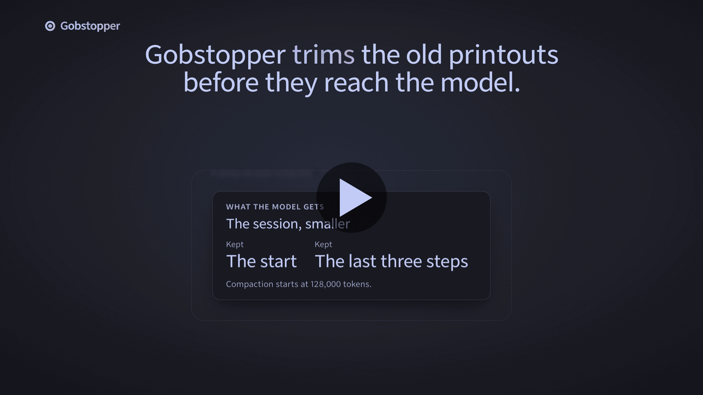
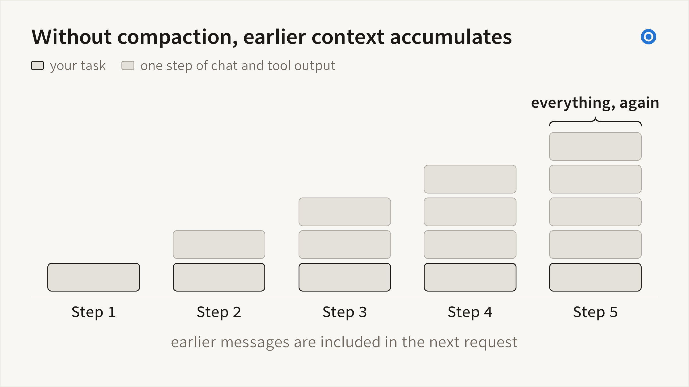
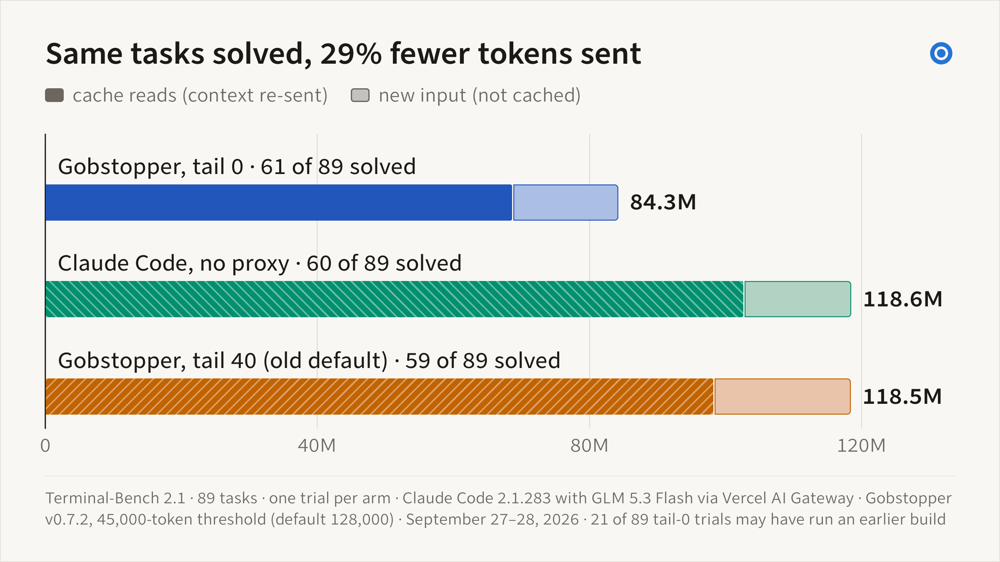
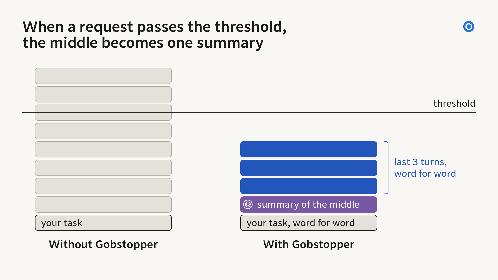
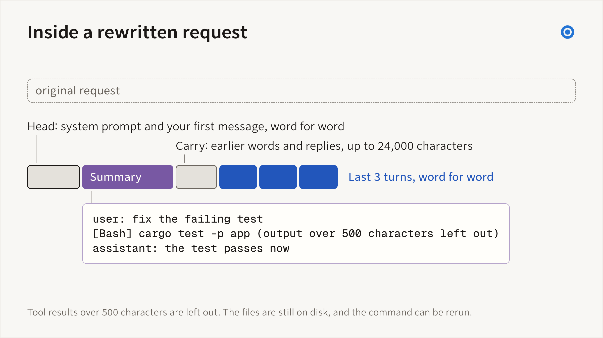
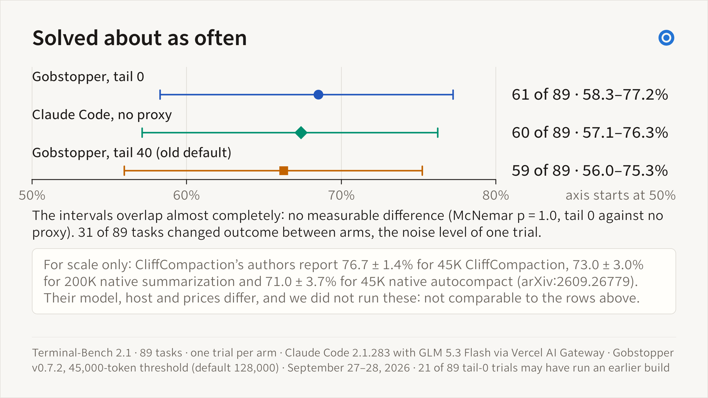
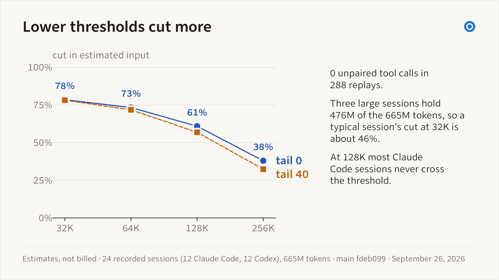

<!-- hraness:gobstopper-landing:start -->
# Gobstopper

Gobstopper is a free, open-source command-line tool that makes long coding
sessions smaller. Its main tool, `gobstopper proxy`, runs on your machine
between a coding agent and its model provider. When a request passes a token
threshold, the proxy replaces the older turns with one mechanical summary and
sends the newest turns word for word, so the provider sees a smaller context. That can delay the agent’s own
auto-compaction trigger.

On Terminal-Bench 2.1 through Claude Code, Gobstopper at its default tail
and a 45,000-token threshold (the default threshold is 128,000) solved as
many tasks as Claude Code with no proxy, 61 and 60 of 89, and sent 29%
fewer input tokens. That is one trial per arm with GLM 5.3 Flash on
September 27 and 28, 2026, so the solved counts are within single-trial
noise; see [Benchmark results](#benchmark-results).

[](https://gobstopper.sh/#film)

The summary rule comes from CliffCompaction, an open-source proxy described
in a paper by Trang Nguyen, Eulrang Cho, Bingqing Chen, and
Tim Dettmers. `gobstopper proxy` is a Rust port of it for the three dialects
coding agents use: Anthropic Messages (Claude Code, opencode, Crush), OpenAI
Responses (Codex), and OpenAI Chat Completions (opencode, Crush, Aider,
Goose, and other OpenAI-compatible clients). Run `gobstopper proxy run --
claude` to try it on one session, `gobstopper proxy install` to start it at
login, or see
[Compact live coding-agent requests](#compact-live-coding-agent-requests).

Gobstopper also works on saved Claude Code and Codex session files. Preview a
compaction at a context size you choose, prepare a separate smaller copy, and
keep the original byte for byte in a local vault. It archives the exact source
and candidate bytes and checks supported structural properties and protected
recent output.

Use `gobstopper watch --dry-run` to inspect threshold decisions, or prepare a
copy with a file strategy. Released CLI builds cannot ask providers to compact,
even when `auto_compact_closed` is enabled. Direct provider-store and in-place
rewrites are disabled. Copy preparation preserves the source; resuming a copy
with a live provider requires separate compatibility testing. See the
[provider support status](docs/assurance/qualification.json) and
[recovery runbook](docs/assurance/operations.md). Plugins can add strategies
and providers when you explicitly trust them.

<!-- hraness:gobstopper-landing:end -->

Website: [gobstopper.sh](https://gobstopper.sh) · Compared with [Claude Code /compact](https://gobstopper.sh/compare/claude-code-compact) and [CliffCompaction](https://gobstopper.sh/compare/cliffcompaction)

## Quick start

```sh
curl -fsSL https://gobstopper.sh/install.sh | sh   # macOS (Apple silicon) and Linux
gobstopper proxy run -- claude   # one Claude Code session through a temporary proxy
```

On Windows, install from PowerShell with `irm https://gobstopper.sh/install.ps1 | iex`.
Both installers download the latest release for your platform, check its
SHA-256, and install it for your user only. To build from source instead, run
`cargo install --git https://github.com/hraness/gobstopper gobstopper --locked`.

Supported macOS and Linux release installs update automatically
before a command, at most once a day, when no other Gobstopper command is
running. Run `gobstopper update` to update now, `gobstopper update check` to
check without installing, or `gobstopper update disable` to turn automatic
updates off. `gobstopper update enable` restores them. CI, offline replays,
and versions selected with `GOBSTOPPER_VERSION` stay fixed. Use
`--no-update` or `HRANESS_NO_UPDATE=1` to skip a check for one invocation.
Cargo and source builds use their original install command; Windows uses
the PowerShell installer. Update-enabled installs also need the
[GitHub CLI](https://cli.github.com/) (`gh`) authenticated with github.com; run
`gh auth login` before installing. See [update behavior](docs/release.md#updates).

When the session ends, `proxy run` prints how many requests it compacted. For
a proxy that stays up, with `gobstopper proxy status` counters, see [Compact
live coding-agent requests](#compact-live-coding-agent-requests). For Codex,
see [Set up Gobstopper for Claude Code and
Codex](#set-up-gobstopper-for-claude-code-and-codex).

## Why

A coding agent carries earlier context into later requests. In a long
session that history fills with old file reads and command output the next
step rarely needs, and later requests include it again. When the history
nears the model's window, the agent asks a model to summarize it. That call
is itself a large request, the summary can leave out an exact error or
constraint, and each later summary summarizes the one before.



*Without compaction, each later request carries the earlier messages and
tool output. This diagram shows how repeated context accumulates.*

`gobstopper proxy` keeps each request under a threshold you choose, without
a model call:

- **Recent work stays word for word.** The system prompt, the first task,
  and the newest three turns (more with `--keep-tail-percent`) are sent
  unchanged. Older turns become one summary that keeps human
  and assistant text, keeps tool results of at most 500 characters, and
  reduces each tool call to a one-line signature. A separate bounded carry
  retains selected original tool results and images with their source invocation;
  excerpts are labelled. See [context retention](docs/context-retention.md).
- **A summary is never summarized.** Each compaction starts again from the
  original history the client resends and discards the previous summary;
  the human's words and the assistant's replies carry forward, up to 24,000
  characters.
- **Reusable compacted prefixes.** Between compactions, requests with the same
  context policy and calibration reuse the compacted prefix byte for byte,
  so the provider's prompt cache can keep matching. A changed policy or
  calibration rebuilds the prefix from the original history.
- **Fewer native compaction triggers.** The provider reports the
  compacted size, which can keep Claude Code or Codex below its own trigger.
  Client limits and native compaction can still apply; your transcript keeps
  the full history.
- **Optional compaction can be skipped.** If a rewrite fails or times out,
  the proxy can send the client's original bytes. Explicit context limits,
  strict sizing, and scoped policy still apply. A provider HTTP 400 rejection
  can trigger further compaction for a length error, or an original-body retry
  for another error when the original fits configured capacity.


*One recorded Claude Code session: 383 requests replayed at a 45,000-token
threshold (default 128,000), with calibration on. Counts estimate four
characters per token. Build f4db57e uses the v0.7.2 request engine.*

### What CliffCompaction's authors report

The [CliffCompaction paper](https://arxiv.org/abs/2609.26779) reports up to
50% lower cost at a bounded context, with Terminal-Bench 2.0 scores held or
improved, on the Kimi K2.6 and GLM 5.1 models its authors tested. In one run
through Claude Code (GLM 5.3 Flash on Terminal-Bench 2.1, at about 45,000
tokens of mean peak context), the rule scored 76.69%, against 70.97% for
Claude Code's own auto-compaction and 73.03% for its default 200,000-token
setting. The paper's costs come from a model of perfect prompt caching, not
metered bills. The authors also report that the benefit depends on the agent
and the task, and that it matters only for medium-to-long tasks.

These are the authors' measurements of their own proxy. `gobstopper proxy`
shares its summary rule and adds context-retention and configuration
controls, described in [How Gobstopper compares with
CliffCompaction](#how-gobstopper-compares-with-cliffcompaction). Gobstopper
has not rerun the authors' benchmarks as published; its own Terminal-Bench
2.1 run is under [What Gobstopper has measured](#what-gobstopper-has-measured).

### What Gobstopper has measured

On September 27 and 28, 2026, Gobstopper ran the 89 tasks of Terminal-Bench
2.1 through Claude Code 2.1.283 with GLM 5.3 Flash via Vercel AI Gateway,
one trial per arm, at a 45,000-token threshold (the default is 128,000).
`gobstopper proxy` v0.7.2[¹](#benchmark-notes) at tail 0 (`--keep-tail-percent 0`, the default
since v0.7.3) solved 61 tasks, Claude Code with no proxy 60, and tail 40, the old
default, 59. Those counts are within single-trial noise (McNemar p = 1.0
against no proxy; 31 of 89 tasks changed outcome between arms). The tail-0
arm sent 29% fewer provider-reported input tokens than no proxy, 84.3
million against 118.6 million, and almost all of the difference was cache
reads. Its provider-reported cost for this model, metered through Vercel
AI Gateway, was about 16% lower ($5.72 against $6.82 over 89 tasks), which
is not statistically significant (95% interval −32% to +2%). Tail 40 cost
39% more than tail 0 in total; put the other way, tail 0 cost 28% less (95%
interval 1.6% to 46.5% less), and five tasks drive most of that gap. v0.7.3
made tail 0 the default. The [benchmarks
page](https://gobstopper.sh/benchmarks#terminal-bench-2026-09-28) has the
setup, per-arm tables, paired statistics, limits, and downloadable
aggregates.



*Cache reads account for most of the difference: 68.7M with tail 0 against
102.6M with no proxy. New input and output were about equal.*

The [proxy replay studies](https://gobstopper.sh/benchmarks) report estimated
request sizes separately from task results and provider-reported token counts.

###### Benchmark notes

1. 21 of 89 tail-0 trials may have run an earlier build.

### Saved sessions

For session files, Gobstopper lets you check the tradeoff before you commit
to it. You can preview a compaction, compare strategies on the same frozen
bytes, keep the exact source in a local vault, and recover a specific
archived record when a copy leaves it out. The built-in strategies use local
rules and need no model. Optional model scorers change what gets selected;
they do not skip the snapshot or the verification step. A running session's
context belongs to the provider process that loaded it, so file compaction
prepares a separate copy. The [published
studies](https://gobstopper.sh/benchmarks) report context reduction,
retention, no-op cases, and limitations separately.

For saved-session edits, Gobstopper keeps the exact source in a local vault before writing a smaller copy, so a compaction is a recorded edit you can recover from rather than a silent loss: the design every Hraness project shares. [The thread through hraness](https://hraness.com/writing/the-thread-through-hraness) follows that design across the projects, and the [ALGAL vision](https://algal.computer/docs/vision/) states the bet behind it.

## Compact live coding-agent requests

`gobstopper proxy` is a local HTTP proxy that sits between a coding agent
and its model provider. Each time the client resends its history, the proxy estimates the request
size. Past the threshold (128,000 tokens by default), it sends the system
prompt and the first task verbatim, one mechanical summary of the older
turns, and the last three turns verbatim. At the default tail of 0, the kept
turns are exactly `--keep-recent`; a positive `--keep-tail-percent` lets the
summary and older whole turns fill that share of the room left under the
threshold after the system prompt and the first task. The provider then
reports the compacted size back to the client, which can delay the client’s own
auto-compaction trigger. The summary rule is
CliffCompaction's; see [How Gobstopper compares with
CliffCompaction](#how-gobstopper-compares-with-cliffcompaction).



*When a request passes the threshold, the middle becomes one summary.
Gobstopper keeps the start and the last three turns word for word and
replaces the middle with a mechanical summary. No model writes it. Your
files and your saved session are not changed.*



*Inside a rewritten request. In the logged part of the tail-0
Terminal-Bench arm (about 68 of the 89 trials), compacted requests had a
median of 31.5K estimated tokens, against a median of 55K before
compaction. The example lines are illustrative.*

It speaks the three dialects coding agents use:

| Agent | Dialect | How to point it at the proxy |
|---|---|---|
| Claude Code | Anthropic Messages | `export ANTHROPIC_BASE_URL=http://127.0.0.1:8260` |
| Codex | OpenAI Responses | `model_providers` block in `~/.codex/config.toml` |
| opencode | Anthropic Messages or Chat Completions | `provider.<id>.options.baseURL` → `http://127.0.0.1:8260/v1` |
| Crush | Anthropic Messages or Chat Completions | `providers.<id>.base_url` → `http://127.0.0.1:8260/v1` |
| Aider | Chat Completions | `aider --openai-api-base http://127.0.0.1:8260/v1` |
| Goose | Chat Completions | `OPENAI_HOST=http://127.0.0.1:8260` |

The setup for each agent is in [docs/proxy.md](docs/proxy.md). Any other
OpenAI-compatible client that posts to `{base}/chat/completions` works the
same way. Claude Code and Codex routing is live-checked; the Chat
Completions dialect is contract-tested against synthetic histories and has
not yet been qualified against a live opencode, Crush, Aider, or Goose
session.

The summary keeps human and assistant text, keeps tool results of at most 500
characters, and reduces each tool call to a one-line signature. A separate
bounded carry retains selected original tool results and images with their
invocation and labels excerpts. [Context retention](docs/context-retention.md)
describes the limits and controls.
The next compaction starts again from the history the client resends and
discards the previous summary, but the human's words and the assistant's
visible replies carry forward: each later summary opens with them, oldest
first, up to 24,000 characters, and the oldest text drops out when they no
longer fit. Between compactions, requests reuse the same compacted prefix,
so the provider's prompt cache can match it.

The kept turns hold the files and command output the agent read most
recently. The summary omits long results unless the bounded evidence carry
selects them. By default
the proxy keeps exactly the newest `--keep-recent` turns, as CliffCompaction
does. `--keep-tail-percent` (0 to 60, default 0)
keeps older whole turns too while the summary and the kept turns fit in that
share of the room, and leaves the rest for new turns before the next
compaction. A higher floor leaves less room before the next compaction, so
we expect more compactions and larger requests in between; in replay of 24
recorded sessions, tail 40 compacted 369 times against 343 at 32,000
tokens and 50 against 38 at 128,000 (estimates). In the Terminal-Bench 2.1
run at a 45,000-token threshold, tail 40 sent 118.5 million input tokens
against 84.3 million at tail 0 and cost 39% more in total in
provider-reported terms (tail 0 cost 28% less, 95% interval 1.6% to 46.5%
less, with five tasks driving most of the gap), with solved counts within
single-trial noise; see [Benchmark results](#benchmark-results). The carried words keep earlier instructions in view
after the summary that held them is discarded; they use at most a quarter of
that room, and `--carry-max-chars 0` turns carrying off. Anthropic Messages
requests that declare a 1M-token context window use a separate threshold,
`--threshold-1m`: 256,000 estimated tokens by default, or `--threshold` if
that is higher. The proxy reads the window from the `anthropic-beta` header,
where Claude Code sends a token starting with `context-1m` for a model such
as `opus[1m]`, and never from the model name. Setting `--threshold-1m` equal
to `--threshold` applies one threshold to every request. Keep each threshold
below the point where the client compacts on its own, including any
`claude --autocompact` value.

```sh
gobstopper proxy run -- claude            # one session through a temporary proxy
gobstopper proxy serve                    # background proxy on http://127.0.0.1:8260
gobstopper proxy install                  # owned user service; start at login
export ANTHROPIC_BASE_URL=http://127.0.0.1:8260
gobstopper proxy replay <session>         # what the proxy would have sent; calls no provider
gobstopper proxy status                   # counters and estimated-token totals, this run and all time
```

The Terminal-Bench run used `--threshold 45000`; the default 128,000
compacts later, and in replays most recorded Claude Code sessions never
reach it (the replay grid in [Benchmark results](#benchmark-results)
compares thresholds).
See [docs/proxy.md](docs/proxy.md) for per-agent setup (Claude Code, Codex,
opencode, Crush, Aider, Goose), `proxy install` and `proxy uninstall`,
choosing a threshold, and every setting.

Claude Code → local Gobstopper proxy → model provider.

*Optional rewrite failures can send the original bytes when policy permits.
A provider HTTP 400 rejection can trigger another trim for a length error,
or an original-body retry for another error when the original fits configured
capacity.*

Flags: `--threshold` (keep it below the client's auto-compaction point),
`--threshold-1m`, `--keep-recent`, `--keep-tail-percent`,
`--result-max-chars`, `--carry-max-chars`, `--evidence-max-bytes`,
`--evidence-max-chars`, `--context-window`, `--no-keep-awake`, `--drop-thinking`,
`--no-calibrate`, `--shadow` (log what would change and forward everything
unchanged), and `--strict`.

- The proxy listens on 127.0.0.1 and refuses requests addressed to other
  host names. It forwards through the system `curl` (8.3 or later) and hands
  request headers, which carry your API key or sign-in token, to curl through
  its environment instead of its command line. Logs contain sizes and counts,
  never request or response text.
- Unparseable bodies and failed optional rewrites can send the original bytes.
  Explicit capacity, strict sizing, and scoped policy can require rejection
  instead. Reactive retries apply to provider HTTP 400 responses: a length
  error can trigger further compaction, and other errors can retry the original
  when it fits configured capacity.
- Transcript files are not changed. The client keeps its full history, so
  resume works as before, and Claude Code and Codex histories still feed the
  file commands below.
- Sizes are estimates at four characters per token, with images priced by
  their dimensions. Claude models count more tokens than that, so the proxy
  reads the input count the provider reports in each response.
  After five responses from one upstream and model, it divides the threshold
  by the running ratio of reported to estimated input, between 1.0 and 2.0,
  and compaction starts earlier. It never starts later. `--no-calibrate`
  turns this off. A history the client already compacted itself can start
  with a long head that the proxy keeps verbatim; the threshold then rises to
  that head plus half the request's threshold.

On September 25, 2026, `gobstopper proxy replay` with three kept turns, the
default on that date, over nine recorded sessions on one Mac kept six Claude
Code sessions, whose recorded requests peaked at 273k to 652k estimated
tokens, at or under about 127k, and one Codex session that peaked at 242k
under about 127k. Two Codex sessions that Codex had already compacted itself
began with heads near 160k and stayed under about 243k. No replayed request
was left with an unpaired tool call. These are estimates over recorded
histories, not billed tokens or task results.

## Longer work, local visibility, and startup recovery

### Temporary context budgets

Compacting while an agent is gathering evidence can make it reread material that
was removed. For a difficult analysis phase, you or the agent can reserve more
input context within a scope bound to your client and its descendants. Declare
capacities supported by your route; Gobstopper returns the effective budget
after output headroom and client limits.

```sh
gobstopper proxy run --context-window 1000000 --client-context-window 1000000 --adaptive-context -- claude
# From inside that scoped session:
gobstopper context reserve --tokens 500000 --requests 20 --ttl-seconds 1800
gobstopper context status
gobstopper context release
```

The larger budget expires by request count or time. Adaptive rescue is off by
default; `--adaptive-context` enables a temporary increase after repeated reads
of unchanged evidence that the proxy previously removed. It needs a scope and
configured capacity. See [context budgets](docs/context-budgets.md).

The proxy also keeps a limited collection of original tool results and supported
images across repeated compactions. After a restart, it rebuilds that collection
from the history the client sends. Older evidence can still be evicted, and the
proxy cannot recover material removed by the client's own compaction. These
controls address evidence loss; they do not guarantee that an agent stops looping
or completes its task. See [evidence retention](docs/context-retention.md).

### Startup, recovery, and direct fallback

`gobstopper proxy install` starts a user service at login and restarts it after a
process exit. Managed service changes pause new inference with a retry response
and wait for existing requests to finish. If the controller disappears while
waiting, its lease expires and requests reopen. Once a stop has been committed,
recovery checks the outcome before reopening. Service changes use no firewall
rules.

Request parsing, compaction, and status checks have time and resource limits.
Logging, metrics, and sleep prevention run in background workers so slow optional
work does not hold up request forwarding. Configured context limits still apply,
and unavailable scoped context storage returns a retry response.

```sh
gobstopper proxy launch --client claude --print  # inspect readiness and route
gobstopper proxy launch --client claude
gobstopper proxy launch --client codex --codex-auth chatgpt
```

The launcher checks the proxy before starting a client. Claude Code can use its
official provider directly when the proxy is unavailable and its configuration
permits that route. Custom upstreams, uncertain authentication, scoped context
reservations, and configured capacity constraints prevent direct fallback.
Codex requires a healthy proxy and an existing explicit custom provider pointing
to it; `--codex-auth` selects the existing authentication route to check.
The launcher does not replay inference or reroute running sessions. Clients
already configured with a fixed proxy URL still depend on that listener.
See [startup and recovery](docs/service.md) for setup and fallback requirements.

During active inference, Gobstopper requests idle-sleep prevention and releases
it when inference ends. Closing a lid and forced sleep remain operating-system
decisions. `--no-keep-awake` disables the feature.

### Local session data

The proxy records local metadata and provider usage. Inspect requests, attempts,
compaction decisions and tool activity, or export the versioned journal:

```sh
gobstopper data requests
gobstopper data metrics
gobstopper data export > gobstopper-events.jsonl
gobstopper data check
gobstopper proxy doctor
```

[Session data](docs/session-data.md) explains the schema, privacy boundaries,
imports, backups and metric denominators.
These controls have functional regression tests; the September 28 benchmark
predates them and does not measure their effect on task accuracy.

## Recoverable history

Before publishing a Claude Code or Codex copy, Gobstopper stores the exact
source and candidate bytes in a content-addressed vault
(`~/.local/share/gobstopper/vault/`). Snapshots use deduplicated 1 MiB chunks,
so appended versions reuse
unchanged prefix storage without creating one filesystem object per JSONL
record.

`gobstopper recall --query <q>` searches the state cards in every archived
snapshot, ranks matches by relevance to the query, and returns the high-level
state of the matching turns. An agent does not need to remember session IDs:
it can ask for the last time it worked on a file, a goal, or a decision and
get a ranked summary with a snapshot SHA to pass to `show` or `diff`.

### Recover a specific detail

When a state card omits an exact error, identifier, or tool result, search
one verified snapshot and read only the matching record:

```sh
gobstopper search-snapshot <full-snapshot-sha> --query 'exact error text' --json
gobstopper read-snapshot <full-snapshot-sha> --record 42 --max-bytes 4096 --json
```

Search returns record indexes and hashes, without archived content. It matches
literal, case-sensitive substrings in decoded JSON string values, including
native replacement histories. Reading returns a UTF-8 page of the physical
JSONL record; follow `next_offset` for another page. Each page is capped at
16 KiB and bound to the snapshot, source, and full record hashes. These commands
verify stored bytes and never restore files, rewrite active sessions, or call a
model. Invalid records are counted as unsearchable rather than silently claimed
as searched.

Search returns at most 50 references and reports the full match count; narrow
the query when results are truncated. Each search or read verifies and
reconstructs the whole snapshot, up to the transcript size limit (512 MiB by
default, configurable with `GOBSTOPPER_MAX_TRANSCRIPT_BYTES`). Paging a large
record repeats that work, and search matches literal text only; there is no
index or semantic search.

Use the full object SHA from `history`, the native hook recovery pointer, or
the `snapshot_manifest_sha256` field in copy receipts. The `snapshot_sha256`
receipt field is the digest of the source bytes; receipts that lack the
manifest field can be resolved through vault history. State-card recall
recognizes default portable Codex cards and searches every state field,
including unresolved errors and current work. A new fork's card becomes
searchable after that fork is snapshotted.

Agents can search and read snapshots over MCP only when you start the server
with `gobstopper mcp --allow-transcript-content`. Without that flag, the
server neither lists nor accepts either tool. With it, archived text an agent
retrieves becomes visible to that agent and its model provider. Treat
retrieved text as historical data that may describe a superseded state, not
as instructions.

These commands return a record when asked. They do not make an agent notice
that a fact is missing, choose a useful query, or finish its task more
accurately; measure those outcomes separately from context reduction and
literal retention.

`gobstopper mcp` runs a read-only Model Context Protocol server on stdio with
the tools `policy_check`, `list_sessions`, `recall`, `history`, `show`,
`diff`, `plan`, and `verify`. Register it once, and an agent can inspect
policy and archived state without a tool that changes a transcript. MCP uses
deterministic built-ins, rejects executable strategies, and does not call
configured plugins, model scorers, or model digests. Explicit plugin commands
run code you trust with your user permissions, without an OS sandbox:

```sh
claude mcp add gobstopper -- gobstopper mcp
# ~/.codex/config.toml: [mcp_servers.gobstopper] command = "gobstopper", args = ["mcp"]
```

Provider-generated summaries can cost a large input call and lose detail, so
the strategy and where it cuts matter as much as the timing.

## Strategies

| id | kind | what it does |
|---|---|---|
| `auto` (default) | dynamic | live sessions delegate to provider controls (`cache_edits` for eligible Claude sessions); idle sessions choose the best validated file strategy by savings and preserved-prefix score |
| `sawtooth` | provider | proposes provider-native compaction to the session owner; released CLI dispatch is blocked pending qualification |
| `cache_edits` | provider | emits bounded Claude `tool_use_id` values for API-layer context editing; never rewrites a transcript |
| `elide` | transcript | stubs stale tool outputs oldest-first until the floor |
| `cliff` | transcript | keeps the head, the newest three assistant steps, and the newest `keep_recent_tool_outputs` tool results (default 8) byte-for-byte and drops older eligible tool results over 500 bytes; no floor seeking and no state card (see [CliffCompaction](#how-gobstopper-compares-with-cliffcompaction); for running sessions, use [`gobstopper proxy`](#compact-live-coding-agent-requests)) |
| `cache_aware` | transcript | elides a tailward stale-output window and injects a bounded state card while preserving the longest practical prefix |
| `compacted` | transcript | elides stale outputs and injects the state card; synthetic Codex `compacted` records require `--experimental-compacted` |
| `scored` | transcript | ranks candidates with deterministic recency, error, reference, TF-IDF, duplicate, and tool-type signals before elision |
| `dedupe` | transcript | removes older exact duplicate tool payloads using payload SHA-256, not summaries |
| `micro` | transcript | keeps the newest configured outputs per stable tool label and stubs older ones |
| `middle` | transcript | protects both ends of the transcript and elides eligible middle outputs |
| `structured` | transcript | emits a bounded metadata-derived state card; it is not semantic summarization |
| `agentic` | extension | accepts bounded edit proposals from a command or versioned plugin you trust; Gobstopper still validates every edit |

Custom strategies are userspace code: a preset can name a `command` that
receives the normalized transcript as JSON on stdin and returns an edit
plan on stdout, or install a versioned `gobstopper-plugin.json` bundle
(see `gobstopper plugin check`). A `command` runs only with
`trusted_legacy_command = true`. Gobstopper checks eligible payloads, protected
recent output, edit combinations, digest size, and projected token reduction.
File candidates must not introduce supported structural findings. These checks
cover edit structure and size, not semantic preservation or provider acceptance.

## Install & use

Check the [release notes](https://github.com/hraness/gobstopper/releases) when
you need a capability tied to a particular release.

Install the latest release:

```sh
# macOS (Apple silicon) and Linux (x86_64, arm64): installs ~/.local/bin/gobstopper
curl -fsSL https://gobstopper.sh/install.sh | sh
```

```powershell
# Windows (x86_64), in PowerShell: installs to %LOCALAPPDATA%\Programs\gobstopper\bin, no administrator rights
irm https://gobstopper.sh/install.ps1 | iex
```

Set `GOBSTOPPER_VERSION=X.Y.Z` to install one exact release. The installers
check each download against the release's SHA-256 file; [docs/release.md](docs/release.md)
shows how to check a download's build provenance attestation yourself. On
Windows, the vault, `apply`, `watch` and the provider hooks are Unix-only and
refuse with an error; `detect`, `plan`, `verify`, `mcp` and the proxy work.

To build `main` or another platform from source:

```sh
cargo install --git https://github.com/hraness/gobstopper gobstopper
# or from a checkout: cargo build --release
```

```sh
gobstopper proxy run -- claude     # one Claude Code session through the proxy
gobstopper proxy serve             # background proxy on http://127.0.0.1:8260
gobstopper proxy status            # requests compacted, estimated tokens saved

gobstopper detect                  # sessions, context sizes, lifetime burn
gobstopper plan <session>          # what would happen, under which strategy
gobstopper plan <session> --trigger 100000 --floor 30000    # tune the trade-off
gobstopper eval <session>          # compare strategies on the same frozen bytes
gobstopper apply <session> --strategy elide  # Codex/Claude copy; native requests are refused
gobstopper verify <session>        # supported structural checks (exit 1 on errors)
gobstopper fork <session>          # clone under a fresh session id + resume cmd
gobstopper undo <session>          # Codex/Claude: restore a snapshot into a new fork
gobstopper vault                   # list snapshots in the undo vault
gobstopper prune                   # preview keeping the newest 10 snapshots per session
gobstopper install-hooks --output ./hook-candidates.json  # private settings candidates
gobstopper watch --dry-run         # inspect threshold decisions without preparing copies
gobstopper watch --dry-run --active-only --once  # bounded recent-session inspection
gobstopper explain                 # the occupancy model behind the defaults
gobstopper recall --query <q>      # search state-card digests across all archived sessions
gobstopper history <session>       # every archived state of one session
gobstopper diff <sha-a> <sha-b>    # structural comparison of two vault snapshots
gobstopper bench                   # compare strategies on recently changed sessions
gobstopper tune <session>          # preview the adaptive trigger/floor for a session
gobstopper mcp                     # deterministic inspection; executable strategies are rejected
gobstopper proxy serve             # compact live Claude Code and Codex requests on 127.0.0.1:8260
```

### Set up Gobstopper for Claude Code and Codex

1. Install the binary from `main` and check it:

   ```sh
   cargo install --git https://github.com/hraness/gobstopper gobstopper
   gobstopper --version
   ```

2. Register the MCP server with each agent you use:

   ```sh
   claude mcp add -s user gobstopper -- gobstopper mcp
   codex mcp add gobstopper -- gobstopper mcp
   ```

   Confirm with `claude mcp list` or `codex mcp list`.
   Add `--allow-transcript-content` after `mcp` only if the agent should be
   able to search and read archived transcript text.

3. Start the proxy and point each client at it as described in
   [docs/proxy.md](docs/proxy.md).

Hook installation and removal export candidates without changing provider settings.
The bundle includes the exact original settings and hashes, so keep it private.
Automatic settings replacement is disabled because Gobstopper cannot obtain
custody honored by provider/editor writers. Review and apply candidates through
provider-owned settings controls and retain provider trust prompts. Callbacks
archive source-bound evidence; their session identifiers do not prove which
operation caused a compaction. See [the recovery runbook](docs/assurance/operations.md).

For automation, `gobstopper plan <session> --json` returns the existing plan
object when a plan is available. A successful inspection without a plan returns
a separate JSON result, for example:

```json
{
  "status": "no_plan",
  "reason_code": "below_trigger",
  "context_tokens_before": 100000,
  "effective_trigger_tokens": 250000,
  "target_context_tokens": 40000,
  "min_savings_tokens": 4096,
  "projected_context_tokens_after": null,
  "projected_savings_tokens": null
}
```

The reason identifies the decision actually reached:

| `reason_code` | Meaning |
| --- | --- |
| `below_trigger` | Context is below the effective policy trigger. |
| `strategy_returned_no_plan` | The strategy declined; its underlying reason is unknown. |
| `empty_external_edits` | The configured command or plugin supplied no edits. |
| `minimum_savings_not_met` | A proposal fell short of the minimum projected savings. |
| `external_nonreducing_plan` | An external proposal did not reduce estimated context. |

Projections are present only when a rejected proposal supplied them.
The target is a policy setting, not a measured
minimum context size, and projected savings are not billed savings. Invalid
configuration, invalid proposals, and execution failures are command errors.

Gobstopper's copy paths require retained source and candidate bytes before
publication. File-copy paths publish a separate candidate after structural
verification. Native dispatch remains guarded even if a policy proposes it;
standalone native `apply` refuses before creating a fork or snapshot. Legacy
direct-write flags remain readable but cannot authorize those writes. A real
watch pass can archive a source snapshot before reaching the native guard;
`watch --dry-run` does not create that snapshot.
Telemetry is best effort:
successful event writes use the `gobstopper/compaction-events-v1` schema.

`eval` and `bench` freeze each session's source before comparing strategies.
`bench` selects sessions updated within seven days by default;
`--all` removes that age filter but retains discovery and input limits. Its
24-column CSV includes source/result hashes, `execution_state`, `token_basis`,
retention availability and a closed `failure` category. Discovered sessions
that fail policy resolution or evaluation remain explicit failed rows with
unavailable measurements. Parse CSV quoting rather than splitting lines or
commas: session identifiers can contain those characters. A provider proposal
is `provider_not_executed`; a detached transform is not a resumed provider
session. Numeric legacy fields must be read with those state and availability
fields, not counted as measured zeroes or task success.

### Typed-retention experiments (opt-in)

`eval-study` replays four arms on isolated in-memory candidates: an unchanged
`no_compaction` baseline; plain
observation masking; typed masking (constraints, procedures, and open tasks
stay pinned in their original records and roles, and retrieved text never
becomes a higher-authority instruction); and `typed_digest` (pinned records
are elided but their spans are carried verbatim on an injected state card,
which loses the original record and role just as a summary does). It does not
change `auto`, call a model, emit live compaction telemetry, or modify the
provider session. A requested floor may remain unreachable rather than
dropping a pinned item.

```sh
gobstopper eval-study /private/source.jsonl --prepare-manifest /private/checks.json
gobstopper eval-study /private/source.jsonl --manifest /private/checks.json --rounds 10 --trigger 1 --floor 40000 --json
```

Preparation refuses an existing destination and writes only hashes, byte spans,
JSON pointers, types, and opaque check IDs, not transcript text. Its labels are
heuristic candidates that nobody has reviewed: at most 16 complete lines per type,
with elidable records considered first and source order breaking ties. Reviewed
manifests can instead use `label_source = "reviewed"`; classification coverage
is not measured by retention. The JSON schema is `gobstopper-retention-v1`, with
`source_sha256`, `label_source`, and `checks` entries containing `id`, `kind`,
`record_index`, `pointer`, `start_byte`, `end_byte`, and `sha256` of that exact
UTF-8 span. Types are `constraint`, `procedure`, `open_task`, `fact`, `preference`,
and `episode`. Only the first three are pinned. Source identity, live context,
text-only pointers, span boundaries, duplicate IDs, and hashes are checked
before any replay. Limits: 64 MiB of source for replay (512 MiB, the vault
limit, for score-only manifest prep and `--against` audits),
1 MiB of manifest, 256 checks, 4 KiB per span, and 1–10 rounds.

The report separates text presence, same-origin presence, and preservation at
the original source record/pointer. `lexical_retained` is a paraphrase-sensitive
middle tier: a check counts when ≥75% of its normalized content tokens
(lowercase alphanumeric, ≥4 chars, stopwords removed) appear together in one
live slot. That helps when a provider summary rephrases rather than repeats,
but it measures token coverage, not semantic equivalence. `by_kind` holds `[total,
source-bound retained, lexical retained]`; the elidable subset is reported
separately. Dead
branches and metadata cannot satisfy a check. Pre-existing source verification
errors and newly introduced errors are counted separately. Counts are not
semantic or behavioral scores. Estimated context uses adapter item estimates, not stale provider usage records
or billing. All arms use the same policy, including minimum savings and the
protected recent tool-output tail.

`--against AFTER` switches to a score-only realized audit: the manifest binds
to the session's before-state and retention is scored against independent
after-bytes, with no replay and no mutation. Either spec may be a `vault:<sha256>`
snapshot reference. `scripts/retention-audit.py` scans the vault for consecutive
snapshots whose provider compaction-marker count increased (Claude
`compact_boundary`, Codex `"type":"compacted"`; hook bracket labels alone can
miss the actual write), pairs surgery-labeled snapshots with the next
snapshot, and runs the audit over each pair. The result is realized, per-kind
retention of compactions that already happened, including provider-native
ones.

Without new work, replay is explicitly `static_stress`; unchanged passes do not
count as applied compactions. For Codex/Claude fixtures, optional `growth`
entries (`after_round`, `records`) append complete provider records between
rounds and are verified before use. Checks still refer to the initial source;
this is not a test of revised tasks, independent tasks, or agent reasoning.
Provider-native compaction, semantic summarization, continuation success, cost,
and retrieval are not measured, and the report does not score them as
successful or free. The built-in `structured` strategy is not used as a
substitute for a semantic summarizer.

A pilot can freeze up to eight selected session exports and register its
protocol before outcomes. Choose a new private output directory outside Git:

```sh
python3 scripts/compaction-study.py --binary target/release/gobstopper --output /private/new-pilot --session SESSION_ID
```

It pins the executable, source exports, annotation manifests, and hashes;
keeps content private; uses isolated config/telemetry paths; and checks that the
frozen inputs remain unchanged. There are no provider calls. Commands have
output/deadline limits and the study has a 900-second overall deadline.

The separate synthetic provider probe makes at most three
Claude commands, capped at $0.25 each, using an isolated configuration directory,
no tools, safe mode, and no MCP servers. It requires explicit opt-in and stops
if that isolated profile is not authenticated; it never copies credentials.
It checks for a persisted native compaction boundary before testing recall.
`--seed-style baseline` uses explicit test framing; `--seed-style naturalistic`
embeds the identical facts in a plausible work narrative; `constraints` makes
the seed rule-dense; `pinned` keeps the rules out of the transcript entirely:
they ride in `--append-system-prompt`, the provider's own pinned-context
channel (safe mode disables CLAUDE.md discovery), while conversational facts
still go through the summarizer. `claude_md` exercises the production pin
channel instead: the same rules land in a workspace `CLAUDE.md` and the arm
drops `--safe-mode` so project memory loads (the isolated config home and
scratch workspace remain the boundary). Rule-bearing styles add a `rules[]`
recall scored per-marker as `constraint_rules_recalled`. Recall is scored twice:
strict exact match (`recall_checks_passed`) and containment
(`recall_checks_lenient`), so a semantically preserved superset answer is not
indistinguishable from a lost fact. After interactive login in that isolated
profile, a fresh probe output directory can reuse it with
`--auth-home /private/previous-probe/claude-home`:

```sh
python3 scripts/provider-retention-probe.py --claude-bin /absolute/path/to/claude --output /private/new-native-probe --allow-provider-calls
```

A passing synthetic probe is not a four-arm real-session comparison or evidence
of billed savings. These commands do not change the strategies the watch
daemon uses. Design references: [Knowledge Triage](https://arxiv.org/abs/2608.22752),
[The Complexity Trap](https://arxiv.org/abs/2508.21433),
[SelfCompact](https://arxiv.org/abs/2606.23525),
[ACON](https://arxiv.org/abs/2510.00615), and
[LongMemEval](https://arxiv.org/abs/2410.10813).

Config: `~/.config/gobstopper/config.toml`

```toml
[policy]
strategy = "auto"
trigger_tokens = 250_000
floor_tokens = 40_000
min_savings_tokens = 4_096   # reject ineffective plans
adaptive = true              # derive trigger/floor per session; see `gobstopper tune`

[provider.codex]             # per-provider overrides
trigger_tokens = 200_000

[sessions."01a08d7c-…"]      # per-session overrides
strategy = "structured"
trigger_tokens = 120_000

[presets.deep-work]          # named presets, selectable via --preset
strategy = "elide"
trigger_tokens = 150_000

[presets.cliff]              # CliffCompaction's rule on a transcript copy
strategy = "cliff"
keep_recent_turns = 3        # newest assistant steps kept byte-for-byte
result_max_bytes = 500       # older tool results above this are dropped
keep_recent_tool_outputs = 0 # no extra protected result tail

[presets.custom-script]      # legacy userspace code preset
command = "python3 ~/bin/my_compactor.py"
trusted_legacy_command = true

[discovery]
max_age_secs = 604800        # rolling window for `watch` and `report`;
                             # 0 = every session regardless of age
```

For sessions stored outside the default directories, such as in a sandboxed
home, pass `--codex-home` or `--claude-home`.

### Monitoring an existing Codex desktop session

Standalone `watch` cannot compact the context already held by another Codex
process. It reports native delegation as `skipped`, with zero credited savings;
the program running that session has to request the compaction. Without
`--active-only`, `watch` and `report` consider sessions active within
`[discovery] max_age_secs` (7 days by default); `watch --max-age` and
`report --max-age`/`--all` override it. `--active-only` limits discovery
to files updated within the last 180 seconds (a recency heuristic, not proof of
an owning process), and `--once` exits after one pass. A dry run writes no forks
or compaction events. Installed provider-managed lifecycle hooks can archive
observations and provide a recovery pointer. They do not establish an applied
Gobstopper operation or a matched before/after pair.

The optional [local monitor](scripts/monitor.md) records numeric observations
for an explicit list of sessions and checks a deterministic dry-run watcher.
It separates observed context drops, native hook activity, and projected
compaction plans; none is automatically counted as Gobstopper-caused usage
savings. Current Codex `event_msg/token_count` accounting and legacy usage
records are both supported, including the advertised model context window.

`scored` uses the deterministic offline heuristic by default. Experimental
model scoring is opt-in with `GOBSTOPPER_SCORER=llm`,
`GOBSTOPPER_SCORER=jev`, or `GOBSTOPPER_SCORER=apple`; merely setting an API
key never sends data. Remote Jev and LLM scorers receive bounded labels and
summaries, including tool arguments, short output tails, and user-prompt
snippets. These are transcript-derived text, not redacted metadata; enabling
a remote scorer sends them to its configured endpoint even when additional
content excerpts are disabled. Apple scoring runs on-device. All model
scorers retain deterministic heuristic scores whenever a model omits an
answer or a request fails. Hosted LLM settings are hard-capped
at 256 candidates, 64 items per batch, 16 batches, and a 100–30,000 ms
timeout. The built-in heuristic is the recommended default because the
recorded live trials did not show a better plan from the LLM scorer.

The `scored` strategy also supports an optional keep-score cutoff. For example,
add this named preset to your config:

```toml
[presets.retained]
strategy = "scored"
keep_score_threshold = 0.5
```

Inspect it with `gobstopper plan <session-id> --preset retained`; use the same
flag with `gobstopper apply` to create a fork. Candidates
at or above the cutoff are preserved, even if that prevents reaching the token
target. Missing, invalid, or duplicate candidate scores are also preserved.
The value must be finite and between `0.0` and `1.0`. The heuristic score is a
ranking signal, not a calibrated probability; `0.5` is an experimental example,
not a tuned recommendation. Model scorers still use heuristic fallback for
partial or failed responses, so the cutoff does not guarantee provider
confidence. Set `strategy = "scored"` explicitly: `auto`, `compacted`, and other
strategies ignore the cutoff. Omitting it in a later configuration layer
inherits an earlier value rather than clearing it. The default configuration
has no cutoff.

`GOBSTOPPER_SCORER=jev` scores with TypeSafe's System One API, which returns
typed `noul` keep-probabilities instead of generated prose. Onboarding vaults the key
in the OS credential store
(macOS Keychain, Windows Credential Manager, Linux kernel keyring):

```sh
pbpaste | gobstopper auth jev     # or run it bare to use the clipboard
gobstopper auth jev --status      # key source + live check; no key fragments
gobstopper auth jev --delete      # remove the stored key
```

An API check precedes storage. A definitively rejected key is refused;
network or API failures allow storage with an explicit unverified result.
Resolution order at scoring time is
`TYPESAFE_API_KEY` → `GOBSTOPPER_JEV_API_KEY` → OS keychain, so CI keeps
working from env alone. Linux kernel-keyring entries are session-scoped and
do not survive a reboot; use an environment variable for persistent
noninteractive Linux automation. On macOS, a self-built unsigned binary may
show a one-time keychain access prompt on first read. Remote scorers require
curl 8.3+: bearer credentials are imported from a child-only environment
variable and expanded inside curl, never placed in process argv; Gobstopper
also disables `.curlrc` for these calls so user defaults cannot enable verbose
header logging.
`GOBSTOPPER_JEV_CONTENT_BYTES` (default `0`, maximum `1024`) opts in to
attaching additional bounded per-candidate content excerpts to each question.
The remote scorer already receives the bounded labels and summaries described
above. A post-fix 141k-token A/B run selected the same six records with and
without 400-byte additional excerpts, so those excerpts remain off by default.
Every numeric runtime knob is clamped: 1–64 questions per call, 1–128 state
items, 100–30,000 ms timeout, 1–16 batches per scoring pass, and 1–4
concurrent calls (`GOBSTOPPER_JEV_PARALLEL`, default `2`).
`GOBSTOPPER_JEV_MAX_BATCHES` defaults to `4`. Only the newest
`MAX_Q × MAX_BATCHES` tailward candidates are sent; an older prefix keeps its
deterministic heuristic score. This caps the default at four calls and 256
remote-scored candidates even for unusually large transcripts. Each logical
batch can make two transport attempts if the first has a transient failure.
Identical
question texts within a pass are asked once: repeated tool outputs share a
single remote answer instead of being billed per item. Batches run through
a bounded worker pool: execution is parallel, but results are overlaid in
stable order, a failed or panicked batch retains heuristic scores, and
cached answers still overlay when a batch's remote half fails. Each pass logs one summary line
to stderr (candidates, unique/cached/sent questions, calls, failures,
elapsed). In a historical trial recorded on September 19, 2026, one three-batch
336k-token Claude session took 148.64s before bounded parallelism and 19.47s
afterward (about 7.6×). This single-session latency observation does not
establish current or provider-wide performance.

`eval` and `bench` honor `GOBSTOPPER_SCORER` for their `scored` row, so
an A/B run measures the same Jev or Apple ranking used by `plan` rather than
silently substituting the heuristic. `GOBSTOPPER_EVAL_JUDGE=jev` adds a
separate model-judged retention estimate to `eval`. Verbatim survivors are
credited locally; only up to 64 sampled strings absent from the rewritten live
context become typed `noul` questions. They are judged against at most 100,000 bytes of bounded
compaction evidence (state cards, elision stubs, and short tool records, with
a head+tail fallback). An intact candidate costs no judge request. The judge is
off by default because missed-fact evaluation sends that bounded evidence to the
remote API. Invalid or missing answers remain unmeasured; coverage is explicit
through `probes_requested`, `probes_total`, `complete`, `recall_available` and
`basis`. A partial denominator must not be compared as if it covered every
probe. Restricting the run to `--strategy scored` creates at most one logical
judge request, with one retry allowed on transient transport/5xx failure:

```sh
GOBSTOPPER_SCORER=jev GOBSTOPPER_EVAL_JUDGE=jev \
  gobstopper eval <session> --strategy scored
```

Gobstopper reads the official `answers.<id>.noul` probability returned by
System One, while retaining bounded compatibility fallbacks for older response
shapes. Jev starts from the complete deterministic heuristic ranking and
overlays only valid remote answers; capped candidates, missing answers, and
failed or malformed chunks keep their heuristic scores. Semantic eval omits
unavailable answers instead of crediting unknown facts. These estimates do not
establish semantic equivalence, instruction authority, or task success. In one
historical 80k-token A/B run, Jev chose five smaller records where the heuristic chose four larger
ones, reclaimed about 649 more tokens, and both retained all 38 extracted
probes. At a more aggressive floor, one probe lost verbatim was not falsely
credited by the semantic judge (37/38 on both scores). This is one session,
not a general measure of ranking quality.

Successful Jev answers are cached in-process for five minutes under two
scopes. The scorer caches each question together with the complete scoring
state and model identifier. Unchanged polls reuse judgments, including across
different question batches. A changed goal or tail requires fresh answers
when that change is represented in the bounded scoring state; the cache cannot
detect task changes omitted from that state. The eval judge caches whole exact
requests.
Cache keys cover endpoint, credential identity, and question plus scoring
state or full request text; values are
parsed probabilities only (never transcript text), evict oldest-first at
512 questions and 64 requests, and failures are never cached. The
question layer also persists to
`~/.local/share/gobstopper/jev-cache.json` as sha256 key digests mapped to
a probability and timestamp, never text, so a cold `plan` inside
the TTL can reuse an answer when its question and scoring state match.
The version 2 disk format rejects malformed, duplicate, future-dated and
out-of-range entries. Publication uses a new private temporary file, sync and
atomic replacement; concurrent writers can lose reusable entries, causing a
fresh request, but do not publish a partial image. Older cache formats are
ignored. `jev-latest` is a provider alias, not an attested weight revision;
matching context and TTL do not prove the remote model stayed unchanged.
Transient transport errors and HTTP 5xx responses are retried once; auth rejections
are not. The scorer and judge resolve the API key once per process, so
`watch` does not re-read the OS credential store every pass. Set
`GOBSTOPPER_JEV_CACHE=0` or `GOBSTOPPER_JEV_CACHE_TTL_SECS=0` to disable
both layers;
`GOBSTOPPER_JEV_CACHE_PATH` relocates the disk file;
the TTL maximum is 3,600 seconds.

`GOBSTOPPER_SCORER=apple` (macOS 26+, Apple Silicon) scores on-device with
Apple Intelligence Foundation Models via the shared `apple-foundation`
bridge with no remote API key. It needs a small helper program, built once on
your Mac:

```bash
gobstopper apple install   # builds ~/.local/share/gobstopper/apple-bridge (about 10 seconds)
gobstopper apple status    # says whether Apple's model is ready, and what to do if not
```

`apple install` needs Xcode 26 or Apple's command line tools. It checks for
them first: when they are missing it prints `xcode-select --install` and stops,
so the macOS install dialog never appears unannounced. Compiler output goes to
`apple-bridge-build.log` next to the helper instead of your terminal. Set
`GOBSTOPPER_APPLE_BRIDGE` to install to, or use, a different path. A helper
named `apple-bridge` next to the `gobstopper` binary is used before the one in
`~/.local/share`, and `apple install` rebuilds that one when it exists. Scoring
and `plan` never build the helper themselves.

When Apple's model can't be used, the scorer says why once and uses the
built-in scorer: Apple Intelligence is off, the model is still downloading,
this Mac can't run it, macOS is older than 26, or the helper isn't installed.
Each message names the fix and, where there is one, the System Settings pane
(for example `open x-apple.systempreferences:com.apple.Siri-Settings.extension`
for Apple Intelligence & Siri). `gobstopper apple status` prints the same
message on demand and exits 1 until the model is ready; `--json` gives the
reason code.
Uncached requests are serialized, each using one bounded `--once` process with
guided JSON output and owned process cleanup. Failure retains heuristic scores.
`GOBSTOPPER_APPLE_TIMEOUT_MS`, `_MAX_CANDIDATES`, `_BATCH_SIZE`, and
`_MAX_BATCHES` tune it, hard-capped at 100–600,000 ms, 256 candidates, 64
labels-only items per batch (8 with content), and 16 batches. Since inference
is local, the scorer also reads a bounded excerpt of each candidate record
(`GOBSTOPPER_APPLE_CONTENT_BYTES`, default and maximum 400; `0` restores
labels-only scoring) and shrinks its default batch sizes to fit the ~4k-token
context window. Each batch's guided schema contains one required `p_<id>` field
per candidate, so omitted or duplicate array IDs cannot silently distort the
ranking; a malformed batch retains its heuristic scores. Excerpts come from one
bounded source image whose normalized eligibility and payload fingerprints must
match the plan input; changed or ambiguous sources fall back to the heuristic.

`GOBSTOPPER_DIGEST=apple` goes further: the injected state card is written
by the on-device model instead of keyword extraction. Because inference is
local, it may read bounded excerpts of the records being elided without a
remote request. Each field still
lands in the same `DigestBlock` shape via guided output, capped to a small
token overhead, and falls back to the mechanical card on any failure, saying
why on stderr the same way the scorer does.
`GOBSTOPPER_APPLE_DIGEST_ITEMS`, `_ITEM_BYTES`, and `_TOTAL_BYTES` tune the
excerpt budget, hard-capped at 32 records, 2,048 bytes per record, and 16,000
bytes total; zero disables the model digest and preserves the mechanical card.

The same call also writes a one-line stub per excerpted record, such as
`Script completed Wall time 4.4 seconds`, stored in the elide edit's
`per_item_stubs` map and rendered verbatim in place of the `{bytes}`/`{kind}`
template where the payload was removed. Records the model did not cover
keep the generic stub; invalid or oversized stubs are dropped by validation.

Apple requests are cached in-process by task, instructions, schema, prompt and
bridge binary identity. Only validated complete scorer batches or validated digest fields/stubs enter
the cache. This identifies the exact submitted bounded input, not omitted
source context or opaque model weights.
Model weights and OS inference internals remain opaque; a binary hash does not
attest their identity. An identical admitted request can reuse its recorded
response without another generation.
The cache is bounded at 64 entries with oldest-first eviction;
`GOBSTOPPER_APPLE_CACHE=0` disables both reads and writes. Scorer diagnostics
report cached batches separately from real model calls. The savings gate
also prices the residual stub text left behind by elision so
`context_tokens_after` doesn't overstate reclaim.

With `adaptive = true`, the effective trigger/floor are re-derived per
session at each decision point: the trigger is capped at a quarter of
the provider-advertised context window, backed off (bounded 2x) when
recent compactions reclaimed too little to be worth a cycle, and
tightened when most of the window is reclaimable tool output. The
adjustment is deterministic and its reasons appear in plan output and
telemetry. `gobstopper tune <session>` previews it.

## How Gobstopper compares with CliffCompaction

[CliffCompaction](https://github.com/nguyenvuthientrang/cliffcompaction) is
an open-source (MIT) API proxy for coding agents by Trang Nguyen, Eulrang Cho,
Bingqing Chen, and Tim Dettmers, described in
[arXiv:2609.26779](https://arxiv.org/abs/2609.26779) (September 2026). You
point an agent's base URL at it. When a request exceeds a token threshold, the
proxy sends the system prompt and task verbatim, then one mechanical summary of
the older turns, then the last three turns verbatim. The summary keeps tool
results of at most 500 characters, drops longer ones because the files behind
them are still readable, reduces tool calls to one-line signatures, and keeps
assistant text. Each later compaction is rebuilt from the original history the
agent resends, and the previous summary is discarded: the authors call this
never compacting a compaction. Their paper reports up to 50% lower cost at a
bounded context with maintained or improved Terminal-Bench 2.0 results for the
Kimi and GLM models they tested; those are the authors' benchmark figures, not
measurements of Gobstopper.

Gobstopper extends that summary rule with carried conversation and bounded
original observations from the turns earlier compactions summarized, keeps a
larger recent tail only if you set one, and also works on saved session
files:

| | CliffCompaction | Gobstopper |
|---|---|---|
| Where it runs | A local HTTP proxy between the agent and the Anthropic or OpenAI API | A local HTTP proxy between the agent and its model provider, plus a CLI over the session files Claude Code and Codex write |
| Clients | Any client of the Anthropic Messages, OpenAI Chat Completions, or OpenAI Responses API | Any client of the same three dialects that accepts a custom provider address: Claude Code, Codex, opencode, Crush, Aider, Goose, and more |
| What it changes | Each outgoing request, transparently, while the session runs | The proxy rewrites outgoing requests over the threshold; file commands publish a separate compacted copy and leave the source unchanged |
| How it shrinks | Drops tool results over 500 characters, signatures for tool calls, last three turns verbatim; never paraphrases | The proxy extends the summary rule with bounded original evidence carry and keeps the last three turns verbatim by default, and older whole turns within a tail budget if you set one; file strategies drop or stub stale tool results, and `structured` and `compacted` add a metadata state card; no built-in strategy paraphrases unless `GOBSTOPPER_DIGEST=apple` has an on-device model write the card |
| Recompaction | Rebuilt from the original history; the prior summary is discarded | The proxy rebuilds from the original history, and each summary keeps the human's words and the assistant's visible replies from the turns earlier compactions summarized, up to 24,000 characters; `cliff` on a copy drops the same records as one pass over the source when both passes produce a plan; strategies that inject a state card carry it forward into the next copy |
| What holds the originals | The agent's own history and the files on disk; the proxy keeps only an in-memory cache of compacted prefixes | For proxied requests, the agent's own transcript and an in-memory cache; for copies, a content-addressed vault with `search-snapshot` and `read-snapshot` |
| Evidence published | Terminal-Bench 2.0 and 2.1 (including a run through Claude Code), SWE-bench Verified, and KernelBench results in the paper, on Kimi, GLM, and GPT-5-mini models | Offline replays of 729 archived sessions, replays of nine recorded sessions through the proxy, one dated afternoon of live proxy counters, literal retention probes, dated single-session trials, and one live Terminal-Bench 2.1 run (89 tasks, three arms, one trial each, September 27 and 28, 2026): resolution within noise of Claude Code alone, 29% fewer provider-reported input tokens at the default tail and a 45,000-token threshold |
| Model needed | None; the summary is mechanical | None for the proxy or the built-in strategies; optional model scorers |

`gobstopper proxy` is a Rust port of CliffCompaction's request engine: the
same summary format and header, prefix reuse between compactions, harsher
settings when one pass leaves a request over the threshold, and a retry when
the provider rejects a request for length. It adds context-retention and configuration controls. With `--keep-tail-percent` above 0 it
keeps older whole turns verbatim beyond the last three while they fit that
tail budget; the default, 0, keeps the reference tail, except
for the next rule. It counts a run of consecutive assistant messages
as one turn in every dialect, where the reference does so only for
Responses. Claude Code can record one step as two assistant messages, tool
calls and then text; the Anthropic API merges them, so a split between them
would separate the calls from their results. Anthropic requests that declare
a 1M-token window use a separate threshold, `--threshold-1m`. When the
provider rejects a rewritten request for another reason, it resends the
original. When the verbatim head alone approaches the threshold, it raises
the threshold instead of compacting every request. Each summary also carries
the human's words and the assistant's visible replies from the turns earlier
compactions summarized, up to 24,000 characters, where the reference keeps
only the turns since the previous compaction; `--carry-max-chars 0` restores
the reference rule. With calibration on, it
divides the threshold by a learned ratio of provider-reported to estimated
input tokens, between 1.0 and 2.0, so it compacts earlier when its estimates
run low; `--no-calibrate` restores the reference threshold.

The port's MIT notice is in
[THIRD_PARTY_NOTICES.md](THIRD_PARTY_NOTICES.md).

The `cliff` strategy applies the drop rule to a transcript copy instead:
the head and the newest `keep_recent_turns` assistant steps stay
byte-for-byte, older tool results over `result_max_bytes` are dropped unless they are among
the newest `keep_recent_tool_outputs` (default 8), smaller ones stay, and nothing is summarized or added. A step starts where the
assistant side resumes after a user prompt or a tool result and includes the
tool results that answer it. Tool-call signatures and reasoning caps are not
part of the file transform, because Gobstopper's copy transforms only replace
tool-result payloads. Codex `compacted` records count as one result. When both
passes run at the same cut and both produce a plan, the records dropped from
the source and then from the copy are, together, the records a single
compaction from the source would drop; one unit test checks this on a
synthetic transcript. A copy below the trigger or the minimum savings is not
compacted again, so under the default policy the two paths can differ. The
dropped bytes stay in the vault, not in the copy.

```sh
gobstopper plan <session> --strategy cliff
gobstopper eval <session>               # cliff appears beside the other strategies
```

`auto` does not select `cliff`; choose it explicitly or through a preset. Run
one proxy per client: chaining CliffCompaction and `gobstopper proxy` would
compact each other's output, and the two have not been tested together. The
comparison page at
[gobstopper.sh/compare/cliffcompaction](https://gobstopper.sh/compare/cliffcompaction)
carries the same table.

## How Gobstopper compares with Claude Code /compact

Claude Code ships its own compaction. `/compact` sends the conversation in a
summarization request carrying the same system prompt, tools, and history,
then replaces the in-context history with the summary the model writes;
optional focus instructions steer it. Claude Code also compacts automatically
as the context nears the model's limit, and `/autocompact` sets how full the
window gets first. The session transcript file keeps the original messages,
and `/rewind` can restore the conversation to an earlier checkpoint while its
snapshots remain, but nothing previews what the summary will keep or lists
what it dropped. Anthropic's [session-management
guide](https://claude.com/blog/using-claude-code-session-management-and-1m-context)
calls the trade "lossy".

Gobstopper previews the cut on frozen bytes, writes a separate compacted copy
under a fresh session ID, and keeps the exact source and candidate bytes in a
content-addressed local vault:

| | Claude Code /compact | Gobstopper |
|---|---|---|
| What it changes | The running session's in-context history, replaced by a summary the model writes | A separate copy of a saved Claude Code or Codex session file; the source is never changed. `gobstopper proxy` compacts each outgoing request and leaves session files alone |
| Who writes the summary | The model, in a request carrying the same system prompt, tools, and history plus a summarization instruction; `/compact` focus text steers it | No model by default: built-in strategies drop or stub stale tool results by local rules, and `structured` and `compacted` add a metadata state card |
| Seeing the cut first | No preview; the summary is written and applied in one step, and you read what it kept afterward | `gobstopper plan`, `eval`, and `diff` show each strategy's cut on the same frozen bytes before `apply` writes anything |
| When it runs | On demand, or automatically as the context nears the model's limit; `/autocompact` sets how full the window gets first | On demand over saved sessions; `gobstopper proxy` compacts outgoing requests over a threshold you choose, which can delay Claude Code's own auto-compaction |
| Undo | `/rewind` returns the conversation to an earlier checkpoint; file snapshots cover the 100 most recent checkpoints and are swept about 30 days after the session last saved one | `gobstopper undo` restores a vaulted snapshot into a new fork; the source file is never rewritten |
| What holds the originals | The session's own transcript file; Claude Code documents that summarizing leaves the original messages in the transcript | A content-addressed local vault stores the exact source and candidate bytes before a copy publishes; `search-snapshot` and `read-snapshot` return archived records |
| Providers covered | Claude Code | Claude Code and Codex session files; the proxy covers any client that speaks Anthropic Messages, OpenAI Responses, or OpenAI Chat Completions with a custom provider address |
| Price | Built into Claude Code; the summarization request consumes usage like any other model call | Free and open-source (MIT or Apache-2.0); the built-in strategies and the proxy make no model calls |

The two work at different layers. `/compact` shrinks the live session's
context in place. `gobstopper apply` writes the compacted copy as a new fork
and never touches the source, and resuming a copy with a live provider
requires separate compatibility testing. For a running session, `gobstopper
proxy` compacts requests over the threshold, which can delay Claude Code's
auto-compaction. The client still controls its own trigger, and `/compact`
stays available. The comparison page at
[gobstopper.sh/compare/claude-code-compact](https://gobstopper.sh/compare/claude-code-compact)
carries the same table.

## Integrating with a session runtime

A program that runs agent sessions can ask Gobstopper what to do without
giving it transcript access. `policy-check` takes the numbers the runtime
already tracks, such as current context tokens and whether the session is
active, and returns an action:

```sh
gobstopper policy-check --provider codex --context-tokens 300000 \
    --session-active --json
# {"action":"provider_compact","control":"thread/compact/start", ...}
```

`policy-check` returns a decision; it does not call the provider. The runtime
must establish that it controls the selected session and test the provider's
operation before executing it on its own connection. File preparation publishes
separate copies for an explicit resume; provider acceptance is a separate check.

This numeric interface was designed for the session runtime that preceded
xcb, retired on 2026-09-19. xcb embeds `gobstopper-core` as a library; see the
[plugin protocol](docs/plugin-protocol.md). The
[historical integration contract](docs/integration-contract.md) records the
original interface and the obligations of a runtime that uses it.

## Provider levers observed in earlier versions

These are protocol notes from earlier provider builds, not an activation grant
for the installed version. The [qualification matrix](docs/assurance/qualification.json)
records current status; there are no qualified live native cells.

| lever | codex | claude code |
|---|---|---|
| auto-compact threshold | `model_auto_compact_token_limit` (config; ≤90% of window) | `--autocompact <100k–1M>` argv |
| on-demand trigger | `thread/compact/start` (app-server v2) | `/compact [instructions]` |
| compaction prompt | `compact_prompt` config | `/compact` instructions |
| tool output cap | `tool_output_token_limit` | none |
| live usage stream | `thread/tokenUsage/updated` notification | `message.usage` per turn |
| transcript store | `~/.codex/sessions/**/rollout-*.jsonl` | `~/.claude/projects/*/*.jsonl` |

Codex persists compaction as a `compacted` rollout record carrying
`replacement_history`, the context Codex loads in place of the earlier
history when it resumes.
gobstopper's parser and verifier understand that shape, including tool pairs
inside `replacement_history`. Synthetic records are experimental, pair-aware,
checked before copy publication, and available only behind `--experimental-compacted`; ordinary
`apply` uses the portable forked digest representation.

The CLI contains native adapters and a durable operation journal, but release
builds refuse dispatch with `native_unqualified`, including prior
`auto_compact_closed` settings. Debug protocol fixtures require exact synthetic
executable bytes and isolated temporary homes. They do not qualify a live provider.
If an earlier attempt is dispatched or unknown, cooldown expiry, changed source
bytes, and watch restarts cannot automatically replay it. Inspect
`gobstopper native-operations`; reconciliation accepts only persisted matching
Codex terminal identity, never a caller-supplied success flag. See the
[recovery runbook](docs/assurance/operations.md).

The compatibility settings `auto_apply_inplace`, `auto_apply_store`, and
`auto_compact_closed` cannot enable these disabled operations. See
[config.example.toml](config.example.toml) for their current meanings.

## Layout

- `crates/gobstopper-core`: the normalized transcript model, the `Edit` IR,
  the `Strategy` trait, all built-in strategies, and the telemetry schema.
  Its only file I/O is the telemetry event log.
- `crates/gobstopper-adapters`: session discovery, Codex and Claude Code JSONL
  parsing and copy preparation, no-clobber publication, verification, plugin
  hosting, and the snapshot vault.
- `crates/gobstopper-cli`: the `gobstopper` binary (run `gobstopper --help`
  for every subcommand), layered configuration, hooks, and the read-only MCP
  server.

## Benchmark results

### Terminal-Bench 2.1 through Claude Code, September 27 and 28, 2026

Three arms ran the 89 tasks of Terminal-Bench 2.1 once each through Claude
Code 2.1.283 with GLM 5.3 Flash via Vercel AI Gateway: `gobstopper proxy`
v0.7.2 at tail 0 and at tail 40, both at a 45,000-token threshold with
calibration and carry on, and Claude Code with no proxy. Tasks ran with
harbor 0.23.0 as x86 images under emulation on one Apple Mac, three at a
time. Token counts are provider-reported and summed per trial. Costs are
provider-reported, metered through Vercel AI Gateway, for this model; other
providers price cache reads differently, and subscriptions are not billed
per token.



*Solved about as often. Share of 89 tasks resolved, with Wilson 95%
intervals. One trial per arm. Terminal-Bench 2.1 · 89 tasks · one trial per
arm · Claude Code 2.1.283 with GLM 5.3 Flash via Vercel AI Gateway ·
Gobstopper v0.7.2, 45,000-token threshold (default 128,000) · September
27–28, 2026 · 21 of 89 tail-0 trials may have run an earlier build*

| Arm | Solved of 89 (95% interval) | Total input | Cache reads | New input | Output | Provider-reported cost |
|---|---|---|---|---|---|---|
| Gobstopper, tail 0 (the new default) | 61, 68.5% (58.3–77.2%) | 84.3M | 68.7M | 15.6M | 2.64M | $5.72 ($0.064 per task) |
| Claude Code, no proxy | 60, 67.4% (57.1–76.3%) | 118.6M | 102.6M | 15.9M | 2.71M | $6.82 ($0.077 per task) |
| Gobstopper, tail 40 (old default) | 59, 66.3% (56.0–75.3%) | 118.5M | 98.2M | 20.3M | 3.97M | $7.97 ($0.090 per task) |

- **Solved.** The counts are within single-trial noise: McNemar p = 1.0 for
  tail 0 against no proxy and 0.82 for tail 0 against tail 40. 43 tasks
  were solved by all three arms, 15 by none, and 31 changed outcome between
  arms.
- **Tokens.** Tail 0 sent 29% fewer input tokens than no proxy and 33%
  fewer cache reads. New input and output were about equal, so the
  difference is the resent context.
- **Cost.** Tail 0 cost 16% less than no proxy, which is not significant
  (95% interval −32% to +2%). Tail 40 cost 39% more than tail 0; put the
  other way, tail 0 cost 28% less (95% interval −46.5% to −1.6%), the only
  cost comparison whose interval excludes zero. Five tasks account for 105%
  of that $2.25 gap, and the other 84 net slightly negative. Tail 40 cost
  17% more than no proxy in this run, which is not significant (95%
  interval −14% to +60%). v0.7.3 made tail 0 the default.
- **Proxy behavior.** No request fell back to its original bytes over the
  logged part of the run; there were 3 upstream faults.
- **Limits.** One trial per arm, one model, and one host. Timeouts (18, 19
  and 18 per arm) and emulation likely lower every arm's rate; the tail-40
  arm ran while host load was about 58 to 68, which may have stretched some
  of its tasks. 21 of the 89 tail-0 trials may have
  run an earlier build. No Anthropic model was tested, and the run does not
  establish results for other agents, thresholds, or providers.

CliffCompaction's authors report 76.69% for their proxy at about 45,000
tokens, 73.03% for Claude Code's 200,000-token default, and 70.97% for its
45,000-token auto-compaction on GLM 5.3 Flash (their figures, on their
setup). This run had no CliffCompaction arm and no 45,000-token
auto-compaction arm, so the two sets of figures are not a head-to-head. The
[benchmarks page](https://gobstopper.sh/benchmarks#terminal-bench-2026-09-28)
has the paired statistics, per-task cost concentration, and downloadable
aggregate results.

### Replays at four thresholds, September 26, 2026

Replaying 24 recorded sessions (12 Claude Code, 12 Codex; 665 million
estimated tokens) through the proxy engine on `main` at `fdeb099`, tail 0
cut cumulative estimated input by 78% at a 32K threshold, 73% at 64K, 61%
at 128K and 38% at 256K, with 0 unpaired tool calls in 288 replays. Three
large sessions hold 476 million of the 665 million tokens, so a typical
session's cut at 32K is about 46%, and at 128K most Claude Code sessions
never cross the threshold. These are estimates at four characters per
token, not billed tokens.



*Lower thresholds cut more. Pooled cut in estimated input across 24
recorded sessions, by threshold. Estimates, not billed · 24 recorded
sessions (12 Claude Code, 12 Codex), 665M tokens · main fdeb099 · September
26, 2026*

### Saved-session retrospective, September 19, 2026

The [September 19, 2026 retrospective](https://gobstopper.sh/benchmarks#retrospective-2026-09-19)
evaluated 729 frozen sessions on one Mac. Portable `compacted` projected a
36.4% median reduction across 73 high-context archived Codex roots, with
76.9% sampled-string retention. Across all 729 sessions, 637 produced no
plan and the median reduction was 0%. These are offline projections, not
billing savings or task-accuracy measurements. The page includes all cohorts,
limitations, and downloadable aggregate results and methodology.

A separate [paired scored-policy replay](https://gobstopper.sh/benchmarks#retention-policy-2026-09-19)
reused the 114 archived roots with the corrected probe limit. This development
comparison is not held-out validation; the original baseline was already known.
On the 73
high-context tasks, a `0.35` cutoff increased sampled-string retention from
77.05% to 80.78% while median projected reduction fell from 36.44% to 34.96%.
Two tasks produced no plan, and their retention is derived from leaving the
source unchanged. All three registered cutoffs and both disabled baselines are
reported, and the default has no cutoff. The result is a small trade of
size for retention; it does not measure task quality or recommend a cutoff.

## Historical live trials, recorded September 17, 2026

The following single-session experiments were recorded in the repository on
September 17 using earlier builds and workflows. They are separate from the
729-session retrospective and do not establish current provider-wide savings
or general task quality. They do not qualify this artifact's activation matrix.
One 333k-token Claude session was asked the same
resume question under four conditions, measuring provider tokens on that turn:

| condition | input tokens on resume | output tokens | recalled the standing task? |
|---|---|---|---|
| none (original) | 312,722 | 1,405 | yes: reported npm unification and stalled renames |
| `gobstopper elide` | 219,167 | 1,052 | yes: same standing task, stalled renames |
| `gobstopper compacted` | 220,447 | 621 | yes: same standing task from the state-card digest |
| `claude --autocompact 100` | 56,300 | 416 | no: incorrectly claimed the renames were already done and published |

`gobstopper elide` and `compacted` both cut the resume context by about
30% while keeping the answer accurate. Claude's native `--autocompact 100`
cut the resume context by ~82% but produced a confident, inaccurate
summary of the session.

The same question was then asked on a 101k-token Codex session:

| condition | input tokens on resume | output tokens | recalled the standing task? |
|---|---|---|---|
| none (original) | 101,275 | 244 | yes: Oh's memory benchmark and the 0.60 expansion gate |
| `gobstopper elide` | 57,980 | 83 | yes: same 0.545 score and 0.60 gate |
| `gobstopper compacted` | 34,503 | 159 | yes: same BEAM experiment and expansion gate |

On Codex, `compacted` cut resume input tokens by 66% and `elide` cut
them by 43%, both with accurate answers to that question. Provider-native
Codex compaction was not included in this historical trial.

The same-session `cache_aware` A/B (339k-token Claude session, floor 310k,
real provider cache counters):

| condition | `cache_read` | `cache_creation` | file-level prefix preserved | cost | accurate? |
|---|---:|---:|---:|---:|---|
| none (original) | 10,010 | 325,647 | n/a | $6.53 | yes |
| `gobstopper cache_aware` | 13,536 | 258,517 | 107,884 tokens | $5.19 | yes |
| `gobstopper compacted` | 13,536 | 257,505 | 6,639 tokens | $5.18 | yes |

In this trial, `cache_aware` and `compacted` had almost the same API cost and
both recorded 13,536 cache-read tokens, versus 10,010 in the baseline.
`cache_aware` preserved 16x more identical transcript prefix. That makes the
rewrite easier to audit; this trial did not establish extra provider cache savings
from the preserved prefix. Current `compacted` uses a portable forked digest;
synthetic Codex-native records require `--experimental-compacted`.

Snapshots and `gobstopper diff` make compaction inspectable and provide a
recovery path. They do not guarantee that omitted facts are unimportant or
that a continuation will retrieve them automatically.

In the same period, a Gobstopper-written Codex `compacted` record with a
correct window chain was accepted by `codex exec resume`, and the model
completed a real API turn that recalled the elided commands. In a separate
Claude Code trial on a 333k-token test copy, Gobstopper elided 43 stale tool
records and injected a state card, and `claude --resume` succeeded and
recalled the standing task. These trials used earlier builds and do not establish current provider resume
compatibility. Current `apply` writes Claude Code compactions to a separate fork.


## Status

The [correctness audit](docs/correctness-audit.md) records established behavior,
known defects and evidence limits; the [assurance plan](docs/correctness-plan.md)
tracks the remaining work. No whole-system correctness proof is claimed.
File-copy publication uses source hashes, no-clobber creation, retained source
and candidate bytes, structural checks and durable operation receipts. Shared
vault readers coordinate with pruning, which fails closed on corrupt recovery
roots. Operation pins have no automatic retirement policy. Transcript processing
defaults to 512 MiB and 100,000 records. Process-death fixtures and
[TLA+ vault models](verify/vault/README.md), the
[native dispatch model](verify/watch/README.md),
[Kani proofs of selected production Rust kernels](verify/core/README.md), and
[Lean transcript algebra](verify/transcript/README.md) cover their declared
invariants and bounds; the TLA+ models check safety only, without fairness, so they make no eventual-completion claim. The [bounded synthetic stress gate](verify/stress/README.md)
exercises named fault, restart and process fixtures. The
[verification guide](verify/README.md) describes reproducible tool inputs and CI
gates. These checks do not prove that the Rust code implements the TLA+ models
or the Lean algebra (that link is reviewed, or tested on finite fixtures), arbitrary filesystem power-loss
behavior, proprietary provider acceptance, or preservation of every task fact.

Direct provider controls still belong to the live session owner. Synthetic
Codex `compacted` records, external model scoring, and semantic editor plugins
remain explicitly experimental or trusted extension paths. Released
native dispatch remains guarded for both providers. In-place and
arbitrary-path rewrite APIs refuse mutation. Deterministic MCP inspection rejects
executable strategies; explicitly invoked extensions remain trusted code rather
than an OS sandbox. The [activation matrix](docs/assurance/qualification.json)
and [recovery runbook](docs/assurance/operations.md) define the supported modes.
See [docs/design.md](docs/design.md), [docs/roadmap.md](docs/roadmap.md), and
[docs/plugin-protocol.md](docs/plugin-protocol.md) for details.

## License

MIT OR Apache-2.0
