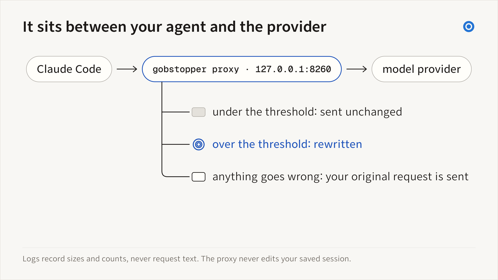
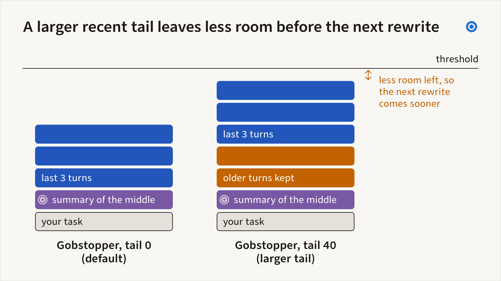

# Compact live coding-agent requests

`gobstopper proxy` sits on 127.0.0.1 between a coding agent and its model
provider. When a request passes the threshold, it sends the head verbatim,
one mechanical summary of the older turns, and the last three turns
verbatim; a positive `--keep-tail-percent` can keep older whole turns too.
The provider then reports the smaller
size back to the client, which can delay the client’s own auto-compaction
trigger. Session files are not changed. The summary rule is
CliffCompaction's (Nguyen, Cho, Chen and Dettmers,
[arXiv:2609.26779](https://arxiv.org/abs/2609.26779)); the port's MIT notice
is in [THIRD_PARTY_NOTICES.md](../THIRD_PARTY_NOTICES.md), and
[How it works](#how-it-works) describes where the proxy departs from it.

The proxy understands three API dialects. Any agent that lets you set a
custom provider address can use it:

| Dialect | Endpoint | Agents |
|---|---|---|
| Anthropic Messages | `.../messages` | Claude Code, opencode, Crush |
| OpenAI Responses | `.../responses` | Codex |
| OpenAI Chat Completions | `.../chat/completions` | opencode, Crush, Aider, Goose, other OpenAI-compatible clients |

The proxy requires system `curl` 8.3 or later. Check it with `curl --version`.

## What you get

- **A smaller request each turn.** Past the threshold, older file reads and
  command output are summarized. Selected original observations can survive in
  bounded evidence carry; see [context retention](context-retention.md). The system
  prompt, the first task, and the newest turns stay word for word, so the
  agent keeps what it was just working on.
- **No model call to compact.** The summary is built by a fixed rule, so a
  compaction costs no extra request and adds no model-written text.
- **No summary of a summary.** Each compaction starts from the original
  history the client resends, so detail is lost once, not again at every
  compaction.
- **A stable prompt cache.** Between compactions, every request carries the
  same compacted prefix byte for byte, so the provider's prompt cache keeps
  matching until the next compaction.
- **Fewer native compaction triggers.** The provider reports the compacted
  size, which can keep the client below its trigger. Client limits still
  apply, and its transcript keeps the full history.
- **Failures send the original.** An unparseable body, an internal error, or
  a provider rejection for any reason other than length sends the client's
  original bytes when they fit an explicitly configured hard context capacity.

CliffCompaction's authors report up to 50% lower cost at a bounded context,
with Terminal-Bench 2.0 scores held or improved, on the Kimi K2.6 and GLM 5.1
models they tested. In one run through Claude Code, their proxy scored above
Claude Code's own auto-compaction. Those are their
measurements of their proxy, computed with a model of perfect prompt caching;
they report that the benefit depends on the agent and the task and matters
only for medium-to-long tasks.

Gobstopper's own run, on September 27 and 28, 2026, put the 89 tasks of
Terminal-Bench 2.1 through Claude Code 2.1.283 with GLM 5.3 Flash via
Vercel AI Gateway, one trial per arm, at a 45,000-token threshold (the
default is 128,000). At tail 0, the proxy solved 61 tasks against 60 with no
proxy, within single-trial noise, and sent 29% fewer provider-reported input
tokens (84.3 million against 118.6 million). Its provider-reported cost for
that model was 16% lower, which is not statistically significant. The
[benchmarks page](https://gobstopper.sh/benchmarks#terminal-bench-2026-09-28)
has the full study; replays and estimates are in the
[README](../README.md#what-gobstopper-has-measured).

## Try it on one session

```sh
gobstopper proxy run -- claude
```

`run` starts the proxy on a free port, sets `ANTHROPIC_BASE_URL` and
`OPENAI_BASE_URL` for that command only, and stops when the command exits.
Codex takes its model provider from `~/.codex/config.toml` or `-c`
overrides, so route it with the provider block in [Codex](#codex).

## Run it in the background

```sh
gobstopper proxy serve        # http://127.0.0.1:8260; --port changes it
```

`proxy install` creates an owned user service on macOS, Linux or Windows:

```sh
gobstopper proxy install
gobstopper proxy status
gobstopper proxy doctor
gobstopper proxy repair
```

The service manager restarts failed processes. Installation verifies service
identity and readiness, and replacement preserves active inference. `--print`
previews the definition. Use `proxy install --replace` to update owned settings;
`proxy repair` diagnoses and reconciles the installed service. Existing manually
written definitions are not overwritten without an exact supported migration.
See [startup, recovery, and sleep behavior](service.md) for platform prerequisites,
legacy Mac migration, logs and rollback.

For a difficult phase, use [temporary context budgets](context-budgets.md).
For local usage, throughput, tool activity and portable exports, see
[session data](session-data.md).

## Claude Code

Add this to your shell profile, then start Claude Code from a new terminal:

```sh
export ANTHROPIC_BASE_URL=http://127.0.0.1:8260
```

Claude Code sends your claude.ai sign-in or API key through the proxy
unchanged. If `ANTHROPIC_API_KEY` is set in your environment, Claude Code
uses that key instead of your claude.ai sign-in, with or without the proxy.
To run one session without the proxy, use `env -u ANTHROPIC_BASE_URL claude`.

## Codex

Codex reads its provider from `~/.codex/config.toml`. With ChatGPT sign-in:

```toml
model_provider = "gobstopper"    # top-level key: above the first [table]

[model_providers.gobstopper]
name = "OpenAI via gobstopper"
base_url = "http://127.0.0.1:8260/backend-api/codex"
wire_api = "responses"
requires_openai_auth = true
```

With an OpenAI API key, use `base_url = "http://127.0.0.1:8260/v1"` and
`env_key = "OPENAI_API_KEY"` instead of `requires_openai_auth`. To run one
session without the proxy, use `codex -c model_provider=openai`.

## opencode

opencode providers take an `options.baseURL`. For an Anthropic-shaped
provider, point it at the proxy root in `opencode.json`:

```json
{
  "provider": {
    "gobstopper-anthropic": {
      "npm": "@ai-sdk/anthropic",
      "options": { "baseURL": "http://127.0.0.1:8260/v1" },
      "models": { "claude-sonnet-4-5": {} }
    }
  }
}
```

For an OpenAI-compatible provider, use the Chat Completions dialect:

```json
{
  "provider": {
    "gobstopper-openai": {
      "npm": "@ai-sdk/openai-compatible",
      "options": { "baseURL": "http://127.0.0.1:8260/v1" },
      "models": { "gpt-5": {} }
    }
  }
}
```

API keys come from opencode's own provider credentials; the proxy forwards
them unchanged.

## Crush

Crush providers accept a `base_url` and a `type`. In `crush.json`:

```json
{
  "providers": {
    "gobstopper": {
      "type": "openai-compat",
      "base_url": "http://127.0.0.1:8260/v1",
      "models": [{ "id": "gpt-5", "name": "GPT-5" }]
    }
  }
}
```

A `"type": "anthropic"` provider with `base_url` pointed at the proxy uses
the Messages dialect instead.

## Aider

Aider routes OpenAI-shaped models through a configurable base URL:

```sh
aider --openai-api-base http://127.0.0.1:8260/v1 --model openai/<model>
# or: OPENAI_API_BASE=http://127.0.0.1:8260/v1
```

## Goose

Goose's OpenAI provider reads `OPENAI_HOST` (and `OPENAI_BASE_PATH`):

```sh
OPENAI_HOST=http://127.0.0.1:8260 goose
```

A declarative custom provider with `engine: openai` pointed at
`http://127.0.0.1:8260/v1` works the same way.

Any OpenAI-compatible client that posts to `{base}/chat/completions` works:
give it a base URL of `http://127.0.0.1:8260/v1`. The bare path
`/chat/completions` (no `/v1`) also routes to the OpenAI upstream, but most
providers expect the `/v1` prefix, so configure the base URL with it.

## Preview on a recorded session

```sh
gobstopper proxy replay <session>
gobstopper proxy replay <session> --threshold 100000 --json
```

`replay` rebuilds the requests a Claude Code or Codex session sent, runs each
through the engine, and reports the peak request with and without the proxy,
the number of compactions and reused prefixes, the context sent across all
requests, and any history left with an unpaired tool call. It calls no
provider. Transcripts do not record the system prompt and tool definitions,
so `--fixed-tokens` (20,000 by default) stands in for them. It also reads a
Claude Code subagent's own transcript. `--json` adds the estimated cache
reads and writes (`est_cache_read_tokens`, `est_cache_write_tokens`),
repeated reads and how many the kept history still held (`repeated_reads`,
`repeated_reads_covered`), and the spacing of compactions
(`back_to_back_compactions`, `min_compaction_gap`), and each compaction
lists the characters its summary carried from the turns earlier compactions
summarized (`carry_chars`). From a Claude Code transcript, `replay` also
reads the provider-reported input and calibrates as the proxy does; see
[Estimate calibration](#estimate-calibration).
From a Claude Code transcript, `replay` rebuilds only the user and assistant
records, so messages typed while the agent worked are missing from its
carried text. `replay` has no `--threshold-1m`; to model a session that
declares a 1M-token window, pass `--threshold 256000`.

## Settings

| Flag | Default | Meaning |
|---|---|---|
| `--threshold` | 128000 | Compact when the estimated outgoing request exceeds this many tokens. Applies to every OpenAI-dialect request and to Anthropic requests that do not declare a 1M-token window; those that do use `--threshold-1m`. Keep it below the client's own auto-compaction point. |
| `--threshold-1m` | 256000, or `--threshold` if higher | `serve` and `run` only. The threshold for Anthropic Messages requests whose `anthropic-beta` header lists a token starting with `context-1m`. It can't be lower than `--threshold`; an equal value applies one threshold to every request. Keep it below the client's own auto-compaction point, including any `claude --autocompact` value. |
| `--keep-recent` | 3 | Newest assistant steps kept verbatim. A request still over the threshold after one pass keeps one. |
| `--keep-tail-percent` | 0 | Share of the room under the threshold, after the fixed request fields and the head, that the summary and the kept steps may fill. Older whole steps are kept while they fit. From 0 to 60; `0` keeps exactly `--keep-recent` steps, as CliffCompaction does. Use a positive value to keep additional older turns. |
| `--result-max-chars` | 500 | Older tool results longer than this are dropped from the summary; shorter ones stay verbatim. |
| `--carry-max-chars` | 24000 | Characters of the human's words and the assistant's visible replies that each summary carries forward from the turns earlier compactions summarized. The oldest text drops out first, and the carried text takes at most a quarter of the room under the threshold after the fixed request fields and the head. `0` turns carrying off. |
| `--drop-thinking` | off | Leave thinking and reasoning text out of summaries. |
| `--no-calibrate` | off | Compare the plain four-characters-per-token estimate with the threshold. By default the threshold is divided by the ratio of provider-reported to estimated input, learned per upstream and model (see [Estimate calibration](#estimate-calibration)). Also a `replay` flag. |
| `--shadow` | off | Log what would change and forward every request unchanged. |
| `--strict` | off | Refuse (HTTP 400) a request still over the threshold after every step, instead of sending it. |
| `--anthropic-upstream` | `https://api.anthropic.com` | Where Anthropic requests go. |
| `--openai-upstream` | `https://api.openai.com` | Where OpenAI API requests (`/v1/...`, `.../chat/completions`) go. Point it at any OpenAI-compatible provider. |
| `--chatgpt-upstream` | `https://chatgpt.com` | Where ChatGPT-signed-in Codex requests (`/backend-api/...`) go. |

## How it works



*It sits between your agent and the provider. If a rewrite fails or the
provider rejects it for any reason other than length, Gobstopper sends the
original bytes. A length rejection gets one more trim and a retry.*


*Inside a rewritten request: the head, one summary, the carried words, and
the last three turns. In the logged part of the tail-0 Terminal-Bench arm
(about 68 of the 89 trials), compacted requests had a median of 31.5K
estimated tokens, against a median of 55K before compaction. The example
lines are illustrative.*

- The proxy compacts Anthropic Messages (`.../messages`), OpenAI Responses
  (`.../responses`), and OpenAI Chat Completions (`.../chat/completions`)
  requests. Token counts, provider-side compaction endpoints, and every
  other path pass through unchanged.
- The head is everything before the first model turn: for Claude Code, the
  first user message; for Codex, the environment and instruction messages
  and the first prompt; for Chat Completions, the `system`, `developer`,
  and `user` messages that precede the first assistant turn. It is always
  sent verbatim, as are the system prompt, tool definitions, and other
  request fields.
- A turn starts at a model message and includes any model messages right
  after it and the tool results that answer them: `tool_result` blocks for
  Anthropic, `function_call_output` items for Responses, and the run of
  `tool` messages answering a `tool_calls` turn for Chat Completions. The
  summary keeps human and assistant text (and readable thinking), keeps tool
  results of at most 500 characters, reduces each tool call to its name and
  up to 150 characters of arguments. Bounded evidence carry additionally retains
  selected original tool results and supported images, with invocation provenance
  and explicit excerpt labels; see [context retention](context-retention.md).
  Calls are never
  separated from their results: the kept tail is whole turns, so a `tool`
  message can never outlive the call it answers. CliffCompaction starts a
  turn at every Anthropic or Chat Completions assistant message; the proxy
  keeps a run of them together, because Claude Code can record one step as
  two assistant messages (the tool calls, then the text).
- The kept tail starts with the newest `--keep-recent` turns and grows one
  older whole turn at a time while the summary and the tail fit in
  `--keep-tail-percent` of the room under the threshold, the threshold minus
  the system prompt, tool definitions, and head. The kept turns hold the
  files and command output the agent read most recently, which the summary
  omits once they pass 500 characters unless evidence carry selects them.
  At the default, 0, the tail is
  exactly the newest `--keep-recent` turns. At 40%, a compacted request leaves 60% of that room for new turns before
  the next compaction. A higher floor leaves less room, so we expect the
  proxy to compact more often and every request between compactions to be
  larger. Replay agrees in direction: over 24 recorded sessions, tail 40
  compacted 369 times against 343 at 32,000 tokens and 50 against 38 at
  128,000 (estimates). In the Terminal-Bench run at a 45,000-token
  threshold, tail 40 sent 118.5 million input tokens against 84.3 million
  and cost 39% more in total, with solved counts within noise.

  

  *Keeping more old turns meant more rewrites and more tokens. In the
  benchmark, tail 40 cost 39% more than tail 0 in provider-reported terms
  (95% interval 2% to 87% more), at a 45,000-token threshold. v0.7.3 makes
  tail 0 the default. Terminal-Bench 2.1 · 89 tasks · one trial per arm ·
  Gobstopper v0.7.2 · September 27–28, 2026 · 21 of 89 tail-0 trials may
  have run an earlier build*

  If the summary, with its carried text, and the newest `--keep-recent`
  turns need more, the proxy keeps those turns anyway, and the next request
  can compact again.
- Each compaction discards the previous summary, as CliffCompaction does,
  but the conversation's words carry forward. The proxy keeps the human's
  messages, including those typed while the agent works, after an
  interrupt, or when rejecting a tool call, and the assistant's visible
  replies from every summarized turn, and each later summary opens with
  them, oldest first. Each carried part, one message's text or one queued
  message, is capped at 4,000 characters. When the carried text passes
  `--carry-max-chars` (24,000 by default) or a quarter of the room under
  the threshold, the oldest parts drop out first. Tool calls, other tool
  results, thinking, skill instructions, shell and local-command output,
  system reminders, and task notifications are never carried. A message
  queued while Claude Code works is read from the system message Claude
  Code sends it in, or from a human turn's text block that is wholly that
  message, never from a tool result, which can quote the same words. In the
  Responses and Chat Completions dialects every user-role message is
  carried, except the context items Codex sends again
  ([roadmap](roadmap.md#9-open-questions)). The first threshold crossing
  has nothing to carry. A proxy that starts on a long history, after a
  restart or when its cache dropped the entry, replays every crossing and
  rebuilds the carry, so its first logged compaction can show a nonzero
  `carry N chars`. `--carry-max-chars 0` restores the reference rule for
  every compaction.
  When the fixed request fields and the head take more than half the
  threshold, the carried text brings some compactions one request sooner,
  which added 2% to the estimated cost of the one replayed session of that
  kind ([design](design.md#why-a-24000-character-carry)).
- Anthropic Messages requests whose `anthropic-beta` header lists a
  `context-1m` token use `--threshold-1m`. Claude Code sends that token for a
  model such as `opus[1m]`. The proxy never reads the window from the model
  name, so a request that does not declare the window uses `--threshold`,
  even on a model whose default window is larger. `gobstopper proxy status`
  counts the Anthropic requests that declared a 1M-token window
  (`requests_1m`), and each compaction log line names the window it applied
  (`window=1m` or `window=base`).
- **Prefix reuse.** Clients resend their original history on every request. The proxy keys each
  compaction by a hash of the original prefix and substitutes it into later
  requests, so the compacted prefix stays byte-stable until the next
  compaction and the provider's prompt cache can match it. The cache lives in
  memory; after a restart, the proxy replays the threshold crossings over the
  full history and reaches the same result. The carried text is the
  exception in two cases, until newer words fill it again: after the proxy
  shortened a summary to fit, which starts the carry over, and when the
  carry's quarter-of-the-room bound grew, which can happen only when
  `--carry-max-chars` is at least half the threshold, rounded down (at the
  default, at a threshold of 48,001 tokens or less).
- **Retry ladder.** If one pass leaves a request over the threshold, or the
  provider rejects the rewrite for length, the proxy tries harsher settings
  in order:
  1. after a length rejection of a request not yet compacted, a compaction
     at tail 0, the newest `--keep-recent` turns and no tail extension;
  2. one kept turn;
  3. assistant text capped at 300 characters and thinking dropped;
  4. after a length rejection, or with `--strict`, the summary shortened to
     its newest parts.

  Without `--strict`, a request still over the threshold is then sent
  anyway; with it, the proxy refuses it (HTTP 400). If the provider rejects
  the rewritten request for any other reason, the proxy resends the
  client's original bytes.
- The threshold is calibrated to the provider's count; see
  [Estimate calibration](#estimate-calibration).
- If the verbatim head alone approaches the threshold, as it can after the
  client compacted a session itself or when a subagent starts with a long
  prompt, the threshold for that session rises to the head plus half the
  request's threshold. A request over the configured threshold but under the
  raised one is sent unchanged, and the log says so (`sent unchanged ...
  under the threshold raised to ~Nk by a large verbatim head`). A request
  over the threshold with nothing to compact, such as one with too few
  turns, is also sent unchanged and logged (`... with nothing to compact`).

### Where it departs from CliffCompaction

The proxy ports CliffCompaction's summary rule, prefix reuse, and retry on a
length rejection. The options below control its departures from that rule.

| # | Departure | Default | Restore the reference |
|---|---|---|---|
| 1 | Keep older whole turns beyond the last three within a tail budget | off (tail 0) | `--keep-tail-percent 0`, the default |
| 2 | Count a run of assistant messages as one turn in every dialect | on | none; keeps tool calls paired with their results |
| 3 | Separate threshold for Anthropic requests that declare a 1M-token window | on | `--threshold-1m` equal to `--threshold` |
| 4 | Resend the original after a rejection for a reason other than length | on | none |
| 5 | Raise the threshold when the verbatim head alone approaches it | on | none |
| 6 | Carry human words and assistant replies from summarized turns, up to 24,000 characters | on | `--carry-max-chars 0` |
| 7 | Calibrate the threshold from provider-reported input, 1.0 to 2.0 | on | `--no-calibrate` |

### Choosing a threshold

The default threshold, 128,000 estimated tokens, sits below the point where
a 200,000-token client compacts on its own. A lower threshold compacts
sooner and cuts more: replaying 24 recorded sessions (12 Claude Code, 12
Codex) at tail 0 cut cumulative estimated input by 78% at 32K, 73% at 64K,
61% at 128K, and 38% at 256K. Three large sessions dominate those pooled
figures; a typical session's cut at 32K is about 46%, and at 128K most
Claude Code sessions never cross the threshold. The Terminal-Bench run used
45,000. Try `gobstopper proxy replay <session> --threshold N` on your own
sessions before you lower it.


*Lower thresholds cut more. Estimates, not billed · 24 recorded sessions
(12 Claude Code, 12 Codex), 665M tokens · main fdeb099 · September 26, 2026*

## Estimate calibration

The proxy estimates a request at four characters per token. Claude models
count more: the ratio depends on the model and the request. Calibration uses reported
usage to adjust later compaction thresholds when the byte estimate runs low.

- After relaying a response, the proxy reads its `usage`: for Anthropic
  Messages, `input_tokens` plus `cache_creation_input_tokens` and
  `cache_read_input_tokens`, from a JSON body or a stream's
  `message_start` event; for OpenAI Responses, `input_tokens` from a JSON
  body or a stream's last event carrying `response.usage` (normally
  `response.completed`); for OpenAI Chat Completions, `prompt_tokens` from
  a JSON body or a stream's last chunk carrying `usage` (sent when the
  client asks for usage in the stream). The OpenAI counts already include
  cached input. It reads a copy of the body after each chunk reached the
  client, so the response is neither changed nor delayed. A missing,
  malformed, or oversized usage record (a JSON body over 4 MiB, no
  `message_start` in the first 64 KiB of an Anthropic stream, or no usage
  event in the last 64 KiB of an OpenAI stream) is skipped.
- Each response adds one sample: reported input divided by the proxy's
  estimate of the request it forwarded. Requests estimated under 1,000
  tokens and samples outside 0.25 to 4.0 are skipped. The proxy keeps a
  running ratio per upstream and model (each sample moves it one eighth of
  the way), for up to 64 pairs, in memory only.
- After five samples, a request's threshold is divided by that ratio,
  bounded to 1.0 to 2.0: at a ratio of 1.25, a 128,000-token threshold
  compacts at 102,400 estimated tokens. The bound means calibration can only
  compact earlier, never later, and never below half the threshold. Stored
  compactions stay keyed by the configured threshold, so a changing ratio
  keeps reusing them.
- `gobstopper proxy status` shows the ratio applied and measured, and the
  sample count, for each upstream and model (`calibrate`, `calibrations`).
  Compaction log lines name a ratio other than 1.0 after the window
  (`window=base, ratio 1.25`), the ledger records `ratio_permille` (1250 for
  1.25), and the proxy logs a line when the applied ratio first departs
  from 1.0 or one sample moves it by 0.05 or more.
- `--no-calibrate` restores the uncalibrated threshold: every request is
  sized and compacted exactly as before calibration existed.

`gobstopper proxy replay` calibrates the same way from the usage a Claude
Code transcript records, unless given `--no-calibrate`. It assumes the
recorded session did not run behind the proxy: behind the proxy, the
recorded usage describes the compacted request the proxy sent, not the
history the transcript holds. The ratio also depends on `--fixed-tokens`.
`--json` adds `usage_requests`, `calibration_samples`,
`last_ratio_permille`, the lowest, median, and highest reported ratio
(`reported_ratio_min_permille`, `reported_ratio_median_permille`,
`reported_ratio_max_permille`), the largest request sent in reported tokens
(`peak_reported_tokens_out`), the requests over the threshold in reported
tokens (`reported_over_threshold`), and each compaction's
`reported_tokens_before`.

## Privacy and security

- The proxy binds 127.0.0.1 and refuses requests addressed to any host name
  other than 127.0.0.1, localhost, or ::1.
- It forwards your request headers, including API keys and sign-in tokens, to
  curl through curl's environment, not its command line.
- Logs contain paths, sizes, counts, and error summaries, never request or
  response text. The status page names each calibrated upstream and model. Carried text stays in the proxy's memory and in the
  requests it forwards; log lines and the ledger below record only its
  size.
- Every compactable request also appends one JSONL record (timestamp,
  dialect, path, estimated tokens in and out, the estimated head, summary,
  and tail sizes, the carried characters, the window, the threshold applied
  to that request, the calibration ratio, and flags) to
  `~/.local/share/gobstopper/proxy-stats.jsonl`, so `gobstopper proxy status`
  reports estimated-token totals for this run and all time across restarts.
  `GOBSTOPPER_STATS_FILE` overrides the path; set it to `off` to disable the
  ledger.
- Unparseable or compressed request bodies are forwarded unchanged.

## Limits

- Sizes are estimates at four characters per token, with images priced by
  their dimensions; the provider's count can differ. Calibration corrects
  the threshold only after five responses, so the first requests of each
  upstream and model use the plain estimate, as does any response that
  reports no usage.
- A summary drops the details of long tool results. The agent can read the
  file or rerun the command, but nothing makes it notice that a detail is
  missing.
- Agents that send requests through a vendor service with no configurable
  model address cannot use the proxy.
- Live use through the proxy has been checked for routing with Claude Code
  2.1.282 and Codex 0.156.1. Chat Completions coverage is tested against
  synthetic histories and recorded contracts, not a live opencode, Crush,
  Aider, or Goose session; provider acceptance of that dialect is
  unqualified.
- Task results under the proxy come from one Terminal-Bench 2.1 run: one
  trial per arm, one model (GLM 5.3 Flash), one host, and a 45,000-token
  threshold. It did not test an Anthropic model, other agents, or the
  default threshold, and its dollar figures are provider-reported prices
  for that model through Vercel AI Gateway, not a general bill.
